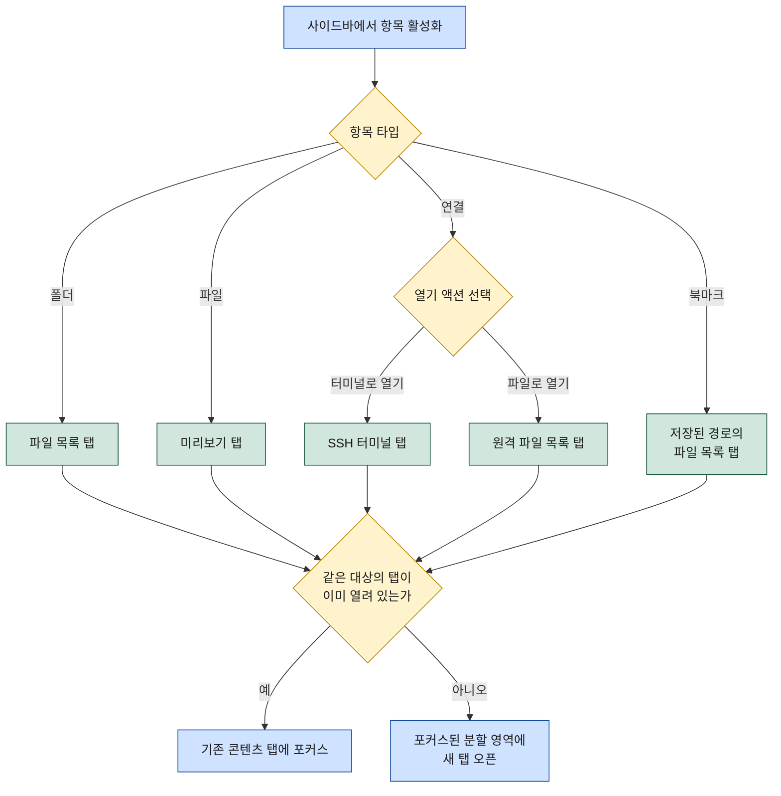

# WorkDeck UI 구조와 레이아웃

이 문서는 WorkDeck의 화면 구조를 명세한다. 사이드바와 워크스페이스로 이루어진 전체 레이아웃, 사이드바의 세 가지 뷰(파일·연결·북마크)와 전환 방식, 사이드바 선택이 워크스페이스의 콘텐츠 탭으로 이어지는 타입별 오픈 규칙, 워크스페이스 좌우 분할, 키보드 중심 조작 원칙, 디자인 방향을 다룬다. 용어 정의는 [01-overview.md](01-overview.md)의 핵심 개념 표를 전제로 하며, 여기서는 정의를 반복하지 않고 동작 규칙을 상세화한다.

## 1. 전체 화면 구조

WorkDeck의 창은 두 영역으로 나뉜다. 화면 왼쪽에 고정된 사이드바가 1차 선택·탐색을 담당하고, 나머지 공간 전체가 워크스페이스로서 콘텐츠 탭이 열리는 작업 영역이 된다. 사이드바 상단에는 뷰 전환 버튼(파일·연결·북마크)이 있고 그 아래에 활성 뷰의 목록이 표시된다. 워크스페이스 상단에는 탭 바가 있고 그 아래에 활성 콘텐츠 탭의 내용이 표시된다.

```
┌────────────────────────────────────────────────────────────────┐
│ WorkDeck                                            (타이틀 바) │
├─────────────┬──────────────────────────────────────────────────┤
│  사이드바   │  워크스페이스                                    │
│ ┌─────────┐ │ ┌──────────────────────────────────────────────┐ │
│ │파일│연결│ │ │ [파일 목록] [미리보기] [SSH 터미널] …  (탭 바)│ │
│ │  │북마크│ │ ├──────────────────────────────────────────────┤ │
│ └─────────┘ │ │                                              │ │
│             │ │                                              │ │
│  활성 뷰의  │ │          활성 콘텐츠 탭의 내용               │ │
│  목록 표시  │ │                                              │ │
│             │ │                                              │ │
│  (트리/목록)│ │                                              │ │
│             │ └──────────────────────────────────────────────┘ │
└─────────────┴──────────────────────────────────────────────────┘
```

- 사이드바는 항상 화면 왼쪽에 위치한다. 너비는 드래그로 조절할 수 있다.
- 워크스페이스는 사이드바를 제외한 나머지 전체를 차지하며, 콘텐츠 탭을 여러 개 동시에 연다.
- 워크스페이스는 좌우로 분할할 수 있다(4장). 분할 시 각 영역이 독립된 탭 바를 가진다.

## 2. 사이드바

### 2.1 세 가지 뷰와 전환 방식

사이드바는 한 번에 하나의 뷰만 표시한다. 뷰는 파일·연결·북마크 세 가지이며, 사이드바 상단의 뷰 전환 버튼 클릭 또는 단축키(5장)로 전환한다. 뷰를 전환해도 워크스페이스의 콘텐츠 탭은 영향을 받지 않는다 — 뷰 전환은 사이드바의 표시 내용만 바꾼다.

```
파일 뷰 ⇄ 연결 뷰 ⇄ 북마크 뷰   (전환 버튼 또는 단축키, 순서 제약 없음)
```

### 2.2 각 뷰의 역할

세 뷰 모두 역할은 동일하다: **1차 선택·탐색**. 목록에서 대상을 찾아 활성화하는 것까지가 뷰의 책임이고, 실제 작업(파일 조작·명령 실행·내용 확인)은 전부 워크스페이스의 콘텐츠 탭에서 일어난다.

| 뷰 | 표시 내용 | 항목 활성화 결과 | 상세 명세 |
|------|-----------|------------------|-----------|
| 파일 뷰 | 로컬 파일시스템의 폴더 트리와 파일 | 폴더 → 파일 목록 탭, 파일 → 미리보기 탭 | [features/file-manager.md](features/file-manager.md), [features/preview.md](features/preview.md) |
| 연결 뷰 | 저장된 연결 프로필 목록 | "터미널로 열기" → SSH 터미널 탭, "파일로 열기" → 원격 파일 목록 탭 | [features/connections.md](features/connections.md) |
| 북마크 뷰 | 저장된 위치(로컬/원격 경로) 목록 | 해당 경로의 파일 목록 탭 (원격은 해당 연결로 열림) | [features/bookmarks.md](features/bookmarks.md) |

연결은 활성화 시 하나의 결과로 직행하지 않고 두 가지 열기 액션 중 하나를 선택한다. 액션 선택 UI(더블클릭 기본 동작·컨텍스트 메뉴 등)는 [features/connections.md](features/connections.md)에서 명세한다.

## 3. 타입별 콘텐츠 탭 오픈 규칙

사이드바에서 항목을 활성화하면 항목 타입에 따라 열리는 콘텐츠 탭이 결정된다. 폴더는 파일 목록 탭, 파일은 미리보기 탭으로 열린다. 연결은 두 액션으로 갈라진다 — "터미널로 열기"는 SSH 터미널 탭, "파일로 열기"는 원격 파일 목록 탭. 북마크는 저장된 경로의 파일 목록 탭으로 열린다(원격 경로면 해당 연결의 원격 파일 목록 탭).

탭을 열기 전에 항상 중복 검사를 한다. **같은 대상이 이미 열려 있으면 새 탭을 만들지 않고 기존 콘텐츠 탭에 포커스한다.** 새 탭이 필요한 경우에는 현재 포커스된 분할 영역에 열린다(분할하지 않았다면 단일 영역).

"같은 대상"의 식별 기준은 탭 타입별로 다음과 같다.

| 콘텐츠 탭 타입 | 같은 대상 판정 기준 |
|----------------|---------------------|
| 파일 목록 탭 (로컬) | 현재 표시 중인 폴더 경로가 같음 |
| 파일 목록 탭 (원격) | 연결 프로필과 현재 표시 중인 경로가 모두 같음 |
| 미리보기 탭 | 파일 경로가 같음 (원격 파일은 연결 프로필 포함) |
| SSH 터미널 탭 | 연결 프로필이 같음 |

같은 연결이라도 SSH 터미널 탭과 원격 파일 목록 탭은 서로 다른 대상이다 — 하나의 연결에서 두 탭이 각각 열려 공존할 수 있다. 중복 검사는 분할 여부와 무관하게 워크스페이스 전체를 대상으로 하며, 기존 탭이 반대쪽 분할 영역에 있으면 포커스가 그 영역으로 이동한다.



## 4. 워크스페이스 분할

워크스페이스는 기본적으로 단일 영역이며, 분할을 실행하면 좌우 2분할이 된다(MVP에서 분할은 좌우 2분할만 지원한다). 분할된 각 영역은 독립된 탭 바와 활성 탭을 가지며, 새 콘텐츠 탭은 항상 포커스된 영역에 열린다. 탭은 드래그 또는 단축키로 반대쪽 영역으로 옮길 수 있다.

분할 해제 시 두 영역의 탭은 닫히지 않고 하나의 영역으로 병합된다. 한쪽 영역의 탭이 모두 닫히면 분할은 자동으로 해제된다.

```
단일 영역 ── 분할 실행 ──→ 좌우 2분할 ── 분할 해제(또는 한쪽 영역의 탭 전부 닫힘) ──→ 단일 영역(탭 병합)
```

분할 상태의 화면 구조:

```
┌─────────────┬───────────────────────────┬────────────────────────────┐
│  사이드바   │  분할 영역 A              │  분할 영역 B               │
│             │ ┌───────────────────────┐ │ ┌────────────────────────┐ │
│  (뷰 목록)  │ │ [파일 목록] … (탭 바) │ │ │ [원격 파일 목록] …     │ │
│             │ ├───────────────────────┤ │ ├────────────────────────┤ │
│             │ │  활성 탭 내용         │ │ │  활성 탭 내용          │ │
│             │ │                       │ │ │                        │ │
│             │ └───────────────────────┘ │ └────────────────────────┘ │
└─────────────┴───────────────────────────┴────────────────────────────┘
```

분할은 듀얼 패널 파일 작업의 기초다. 양쪽 영역에 파일 목록 탭을 하나씩 배치하면 로컬↔로컬·로컬↔원격·원격↔원격 어느 조합이든 같은 UX(F5 복사 / F6 이동 / 드래그앤드롭)로 파일을 옮길 수 있다. 파일 작업의 상세 명세(진행률·충돌 처리 포함)는 [features/file-manager.md](features/file-manager.md)를 따른다.

## 5. 키보드 중심 조작 원칙

WorkDeck의 핵심 사용자는 터미널 작업자다. 따라서 모든 핵심 동작 — 뷰 전환, 사이드바 탐색, 탭 오픈·전환·닫기, 분할 전환, 분할 영역 간 이동 — 은 마우스 없이 키보드만으로 도달할 수 있어야 한다.

방침:

1. **macOS 우선, 크로스플랫폼 대응** — 기본 조합은 macOS의 `Cmd` 기반으로 설계하고, Windows/Linux는 `Ctrl`로 대응한다(ADR-0001의 macOS 우선 출시 방침과 일치).
2. **터미널 키 충돌 최소화** — 터미널 탭이 포커스일 때 일반 키 입력은 모두 터미널로 전달한다. 앱 전역 단축키는 `Cmd`(`Ctrl`) 조합으로만 구성해 셸·TUI 프로그램의 키와 겹치지 않게 한다.
3. **관습 준수** — 탭·분할 조작은 VSCode 관습을, 파일 작업 키(F5/F6)는 듀얼 패널 파일 관리자 관습을 따른다.

아래 키맵은 초안이며, 최종 확정은 구현 단계에서 한다. 파일 작업 키(F5 복사, F6 이동 등)는 [features/file-manager.md](features/file-manager.md)에서 명세한다.

| 동작 | macOS (초안) | Windows/Linux (초안) |
|------|--------------|----------------------|
| 파일 뷰로 전환 | `Cmd+1` | `Ctrl+1` |
| 연결 뷰로 전환 | `Cmd+2` | `Ctrl+2` |
| 북마크 뷰로 전환 | `Cmd+3` | `Ctrl+3` |
| 사이드바 ↔ 워크스페이스 포커스 이동 | `Cmd+0` | `Ctrl+0` |
| 다음 / 이전 콘텐츠 탭 | `Ctrl+Tab` / `Ctrl+Shift+Tab` | `Ctrl+Tab` / `Ctrl+Shift+Tab` |
| 활성 탭 닫기 | `Cmd+W` | `Ctrl+W` |
| 분할 토글 (분할 실행 / 해제) | `Cmd+\` | `Ctrl+\` |
| 분할 영역 간 포커스 이동 | `Cmd+Opt+←/→` | `Ctrl+Alt+←/→` |
| 활성 탭을 반대 분할 영역으로 이동 | `Cmd+Opt+Shift+←/→` | `Ctrl+Alt+Shift+←/→` |

## 6. 디자인 방향

WorkDeck의 UI 모양과 상호작용 패턴은 VSCode를 차용한다. 핵심 사용자(터미널 작업자·개발자)에게 이미 몸에 밴 관습을 그대로 쓰는 것이 학습 비용을 없애는 가장 빠른 길이고, 사이드바·탭·분할이라는 WorkDeck의 구조가 VSCode의 구조와 1:1로 대응하기 때문이다.

| WorkDeck 요소 | 차용하는 VSCode 패턴 |
|---------------|----------------------|
| 사이드바 뷰 전환 버튼 | 액티비티 바 — 아이콘 세로 배치, 활성 뷰 강조 |
| 사이드바 목록/트리 | 사이드 바의 탐색기 트리 — 조밀한 행, 호버 시 인라인 액션 아이콘 |
| 워크스페이스 탭 바 | 에디터 탭 — 닫기 버튼, 드래그 재배열, 활성 탭 강조 |
| 워크스페이스 분할 | 에디터 그룹 분할(Split Editor) |
| 컨텍스트 메뉴 | 항목 우클릭 메뉴 관습 |

동시에, 웹페이지가 아니라 데스크톱 애플리케이션으로 느껴지도록 전체적인 간결함을 유지한다:

1. **높은 정보 밀도** — 큰 여백과 장식용 타이포그래피를 배제하고, 조밀한 행 높이와 13px 내외의 시스템 폰트를 기본으로 한다.
2. **절제된 시각 요소** — 얇은 1px 구분선과 제한된 색 팔레트를 쓰고, 색은 상태(활성·선택·오류) 표시에만 사용한다.
3. **즉각적인 반응** — 화면 전환·탭 오픈에 장식성 애니메이션을 넣지 않는다.
4. **네이티브 관습 준수** — 파일 선택·확인은 OS 표준 다이얼로그를 사용하고, 다크/라이트 테마는 OS 설정을 따른다.

## 7. 관련 문서

- [01-overview.md](01-overview.md) — 핵심 개념 정의와 문서 세트 목차
- [features/file-manager.md](features/file-manager.md) — 파일 목록 탭과 분할 기반 듀얼 파일 작업
- [features/connections.md](features/connections.md) — 연결 프로필과 두 가지 열기 액션
- [features/terminal.md](features/terminal.md) — 로컬/SSH 터미널 탭의 생성 조건과 세션 수명
- [features/preview.md](features/preview.md) — 미리보기 탭의 지원 타입과 동작
- [features/bookmarks.md](features/bookmarks.md) — 북마크의 저장·열기 규칙
