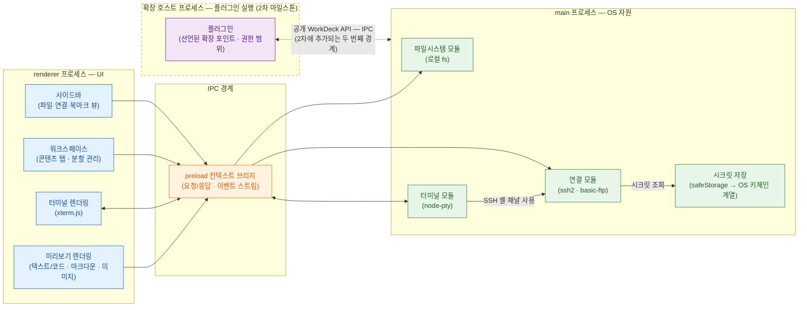

# WorkDeck 아키텍처

WorkDeck은 Electron + TypeScript 기반 크로스플랫폼 데스크톱 앱이다(macOS 우선 출시, 근거: [ADR-0001](../.forge/adr/0001-electron-over-tauri.md)). 이 문서는 main/renderer 프로세스의 책임 분리와 IPC 경계, 네 개 핵심 모듈(파일시스템·연결·터미널·미리보기)의 구성, 핵심 라이브러리 선택, 설정·연결 프로필 저장과 시크릿 보관 방침을 정의한다. 기능별 상세 동작은 각 기능 문서([features/](features/))를 따르고, 이 문서는 그 기능들이 어느 프로세스의 어느 모듈에서 구현되는지의 기준을 제공한다.

## 1. 프로세스 구조와 IPC 경계

### 1.1 책임 분리 원칙

Electron 앱은 OS 자원에 접근하는 **main 프로세스** 하나와 화면을 그리는 **renderer 프로세스**로 나뉜다. WorkDeck의 책임 분리 원칙은 하나다 — **OS 자원과 네트워크, 시크릿을 만지는 코드는 전부 main에, 화면에 그리는 코드는 전부 renderer에 둔다.** renderer는 어떤 경우에도 파일시스템·네트워크·시크릿에 직접 접근하지 않고, 반드시 IPC를 거친다.

| 프로세스 | 책임 |
|----------|------|
| **main** | 로컬 파일시스템 접근(목록·읽기·복사·이동), PTY 생성·관리, SSH/SFTP/FTP 연결 수립·유지, 연결 프로필과 시크릿 보관 |
| **renderer** | 사이드바(파일·연결·북마크 뷰)와 워크스페이스(콘텐츠 탭·분할) UI, xterm.js 기반 터미널 렌더링, 미리보기 렌더링(텍스트/코드 구문 강조·마크다운·이미지) |

두 프로세스 사이의 IPC 경계는 preload 스크립트의 컨텍스트 브리지로만 열린다. renderer에 노출되는 것은 모듈별로 정의된 API 표면뿐이며, Node.js API 자체는 renderer에 노출하지 않는다(contextIsolation 활성).

아래 다이어그램이 전체 프로세스/모듈 구조다. renderer의 UI 구성 요소가 IPC 경계를 거쳐 main의 모듈에 도달하고, SSH 터미널이 연결 모듈의 셸 채널을 사용하며, 시크릿은 연결 모듈 뒤편의 main 전용 저장소에 격리되는 구조를 보여준다.

여기에 2차 마일스톤부터 **확장 호스트 프로세스**가 추가된다([05-plugin-system.md](05-plugin-system.md), [ADR-0002](../.forge/adr/0002-plugin-extension-host.md)). 플러그인 코드는 main도 renderer도 아닌 이 전용 프로세스에서 실행되고, 매니페스트에 선언한 확장 포인트·권한 범위 안에서 공개 WorkDeck API(IPC)로만 main과 통신한다. renderer↔main의 기존 IPC 경계(preload 컨텍스트 브리지)는 그대로 유지되고 확장 호스트↔main에 두 번째 IPC 경계가 추가되는 구조이며, 아래 다이어그램에는 2차 추가분을 점선으로 표시했다. 구현 시기는 2차지만 확장 포인트 개념은 지금부터 아키텍처에 반영한다 — 코어 모듈이 처음부터 확장 가능한 경계로 설계되게 하기 위함이다(2장 각 모듈 서술과 2.6절).



### 1.2 IPC 통신 패턴

IPC는 두 가지 패턴만 사용한다. **요청/응답**(`ipcRenderer.invoke` / `ipcMain.handle`)은 한 번 요청하고 한 번 결과를 받는 작업 — 디렉터리 목록 조회, 파일 내용 읽기, 연결 프로필 CRUD — 에 쓴다. **이벤트 스트림**(`webContents.send` / `ipcRenderer.on`)은 지속적으로 데이터가 흐르는 작업 — 터미널 입출력, 파일 복사·이동 진행률, 연결 상태 변화 — 에 쓴다.

요청/응답의 대표 흐름(사이드바에서 폴더를 활성화해 파일 목록 탭을 여는 경우):

```
renderer: 디렉터리 목록 요청(invoke) → main: 파일시스템 모듈이 fs 조회
→ 결과 배열 반환 → renderer: 파일 목록 탭 렌더링
```

이벤트 스트림의 대표 흐름(터미널 세션):

```
renderer: 키 입력 전달 → main: 터미널 모듈이 PTY/셸 채널에 기록
→ PTY 출력 발생 → main: 출력 이벤트 발행 → renderer: xterm.js에 기록
```

## 2. 모듈 구성

main 프로세스는 네 개 모듈로 구성한다. 각 모듈은 자신의 자원만 소유하고, 다른 모듈의 자원이 필요하면 그 모듈의 인터페이스를 거친다.

### 2.1 파일시스템 모듈

로컬 파일시스템에 대한 모든 접근을 소유한다. 디렉터리 목록 조회, 파일 내용 읽기(미리보기용), 로컬↔로컬 복사·이동과 진행률 이벤트 발행을 담당한다. 원격 경로는 다루지 않는다 — 원격 파일 접근은 전부 연결 모듈 소관이다. 로컬↔원격 파일 작업에서는 로컬 쪽 스트림을 이 모듈이, 원격 쪽 스트림을 연결 모듈이 담당하고 main 안에서 두 스트림을 연결한다. 복사·이동의 UX 상세(충돌 처리 등)는 [features/file-manager.md](features/file-manager.md)를 따른다.

### 2.2 연결 모듈

연결(SSH/SFTP/FTP 통합 프로필)의 수립·유지·해제를 소유한다. 하나의 연결 프로필에서 "터미널로 열기"(SSH 셸 채널)와 "파일로 열기"(SFTP 또는 FTP 세션) 두 액션을 제공하며, 프로토콜별 구현은 ssh2(SSH 셸·SFTP)와 basic-ftp(FTP)로 나뉜다. 원격 디렉터리 목록·파일 읽기·전송 스트림도 이 모듈이 제공한다. 인증에 필요한 시크릿은 시크릿 저장(4절)에서만 조회하고, renderer로는 절대 내보내지 않는다. 프로필 필드 정의와 CRUD는 [features/connections.md](features/connections.md)를 따른다.

연결 모듈은 확장 포인트 ②(연결 프로토콜)의 경계다 — ssh2·basic-ftp를 다루며 쓰는 내부 인터페이스(수립·해제, 원격 목록·읽기·전송 스트림)가 2차 마일스톤에 공개 계약으로 굳어지고, 플러그인이 S3·WebDAV 같은 새 프로토콜을 같은 인터페이스로 제공한다([05-plugin-system.md](05-plugin-system.md) 2장).

### 2.3 터미널 모듈

터미널 세션의 수명을 소유한다. 로컬 터미널 탭 요청에는 node-pty로 로컬 셸 PTY를 생성하고, SSH 터미널 탭 요청에는 연결 모듈에서 해당 연결의 SSH 셸 채널을 받아 세션으로 감싼다. 두 경우 모두 renderer에는 동일한 세션 인터페이스(입력 기록, 출력 스트림, 크기 변경, 종료)로 노출되므로, renderer의 xterm.js 렌더링 코드는 로컬/SSH를 구분하지 않는다. 세션 수명·종료·재연결 규칙은 [features/terminal.md](features/terminal.md)를 따른다.

### 2.4 미리보기 모듈

미리보기는 renderer 쪽 모듈이다. main에는 미리보기 전용 코드가 없다 — 파일 내용은 로컬이면 파일시스템 모듈, 원격이면 연결 모듈이 그대로 전달하고, 타입 판별과 렌더링(텍스트/코드 구문 강조, 마크다운 렌더+원본 토글, 이미지 확대/축소)은 전부 renderer의 미리보기 모듈이 수행한다. 지원 타입별 동작과 미지원 타입 처리는 [features/preview.md](features/preview.md)를 따른다.

미리보기 모듈은 확장 포인트 ①(미리보기 렌더러)의 경계다 — 타입 판별과 렌더러 선택 지점이 2차 마일스톤에 플러그인에게 열려, 플러그인이 새 파일 타입(PDF·영상/오디오·압축파일 등)의 판별 기준과 읽기 전용 렌더러를 등록한다([05-plugin-system.md](05-plugin-system.md) 2장).

### 2.5 모듈 경계 요약

| 작업 | 진입 모듈 | 경유 |
|------|-----------|------|
| 로컬 폴더 → 파일 목록 탭 | 파일시스템 모듈 | — |
| 원격 폴더 → 원격 파일 목록 탭 | 연결 모듈 | 시크릿 저장(인증 시) |
| 로컬 터미널 탭 | 터미널 모듈 | — |
| SSH 터미널 탭 | 터미널 모듈 | 연결 모듈 → 시크릿 저장 |
| 파일 → 미리보기 탭 | 파일시스템 또는 연결 모듈(내용 전달) | renderer 미리보기 모듈(렌더링) |
| 로컬↔원격 복사·이동 | 파일시스템 + 연결 모듈(스트림 연결) | — |

### 2.6 워크스페이스·명령·테마의 확장 포인트 경계

확장 포인트 경계는 위 모듈들에만 있지 않다. renderer의 **워크스페이스**(사이드바·콘텐츠 탭 UI)는 확장 포인트 ③(콘텐츠 탭 + 사이드바 뷰)의 경계다 — 콘텐츠 탭 타입과 사이드바 뷰를 등록하는 지점이 플러그인에게 열려, 웹 브라우저 탭 같은 새 작업 도구가 코어 수정 없이 추가된다. **명령·컨텍스트 메뉴·테마**를 처리하는 renderer 전역 UI는 확장 포인트 ④의 경계다 — 명령 정의·컨텍스트 메뉴 항목·테마를 등록하는 지점이 열린다. 확장 포인트 4종의 명세와 2차 내 도입 순서는 [05-plugin-system.md](05-plugin-system.md)를, 확장 호스트 실행 모델은 [ADR-0002](../.forge/adr/0002-plugin-extension-host.md)를 따른다.

## 3. 핵심 라이브러리

스택 선택 근거는 [ADR-0001](../.forge/adr/0001-electron-over-tauri.md)이다 — 이 도메인(터미널 + SSH + SFTP/FTP + 파일 관리 통합)에서 검증된 조합이고, VS Code 터미널·Tabby 등 통합 레퍼런스가 풍부해 막힐 위험이 가장 낮다.

| 라이브러리 | 프로세스 | 역할 |
|------------|----------|------|
| **node-pty** | main | 로컬 셸 PTY 생성·관리 (터미널 모듈) |
| **xterm.js** | renderer | 터미널 화면 렌더링 — 로컬/SSH 세션 공용 |
| **ssh2** | main | SSH 셸 채널("터미널로 열기")과 SFTP 세션("파일로 열기") (연결 모듈) |
| **basic-ftp** | main | FTP 세션("파일로 열기") (연결 모듈) |

## 4. 설정·연결 프로필 저장과 시크릿 보관

### 4.1 저장 위치

설정과 연결 프로필은 Electron의 userData 디렉터리(`app.getPath('userData')`, macOS 기준 `~/Library/Application Support/WorkDeck/`) 아래 설정 파일로 저장한다. 여기에 저장하는 것은 시크릿을 제외한 프로필 정보(호스트, 포트, 사용자명, 프로토콜 등)와 앱 설정, 북마크다. 프로필 필드의 상세 정의는 이 문서에서 중복하지 않는다 — [features/connections.md](features/connections.md)가 소관이다.

### 4.2 시크릿 보관 방침

비밀번호·개인 키 패스프레이즈 같은 시크릿은 설정 파일에 평문으로 저장하지 않는다. Electron `safeStorage`로 암호화해 보관한다 — safeStorage는 OS 키체인 계열 저장소(macOS Keychain, Windows DPAPI, Linux libsecret)에서 파생한 키로 암호화하므로, 설정 파일이 유출되어도 시크릿은 해당 OS 사용자 계정 밖에서 복호화되지 않는다.

시크릿 접근 규칙은 두 가지다.

1. **복호화는 main에서만** — safeStorage API는 main 프로세스에서만 호출한다.
2. **renderer에는 시크릿 원문을 절대 전달하지 않는다** — renderer는 "시크릿이 저장되어 있는지" 여부만 알 수 있고, 인증은 main의 연결 모듈이 내부에서 수행한다.

연결을 열 때의 시크릿 흐름은 다음과 같다. 시크릿이 IPC 경계를 넘지 않는다는 점이 핵심이다.

```
renderer: 연결 열기 요청 → main: 프로필 로드 → safeStorage 복호화
→ 연결 모듈이 인증·연결 수립 → renderer: 연결 성공/실패 결과만 수신
```

## 5. 관련 문서

- [01-overview.md](01-overview.md) — 제품 개요와 핵심 개념
- [02-ui-layout.md](02-ui-layout.md) — 사이드바·워크스페이스·콘텐츠 탭 화면 구조
- [features/](features/) — 기능별 상세 명세 (file-manager, connections, terminal, preview, bookmarks)
- [04-roadmap.md](04-roadmap.md) — MVP와 이후 마일스톤
- [05-plugin-system.md](05-plugin-system.md) — 플러그인 시스템 설계 (확장 포인트 · 확장 호스트 · 매니페스트, 구현은 2차 마일스톤)
- [ADR-0001](../.forge/adr/0001-electron-over-tauri.md) — Electron + TypeScript 채택 근거
- [ADR-0002](../.forge/adr/0002-plugin-extension-host.md) — 확장 호스트 프로세스 실행 모델 채택 근거
