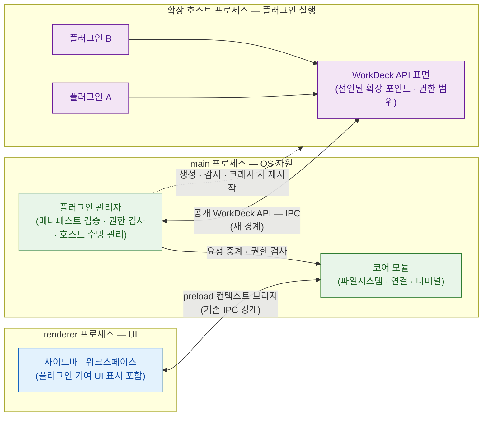
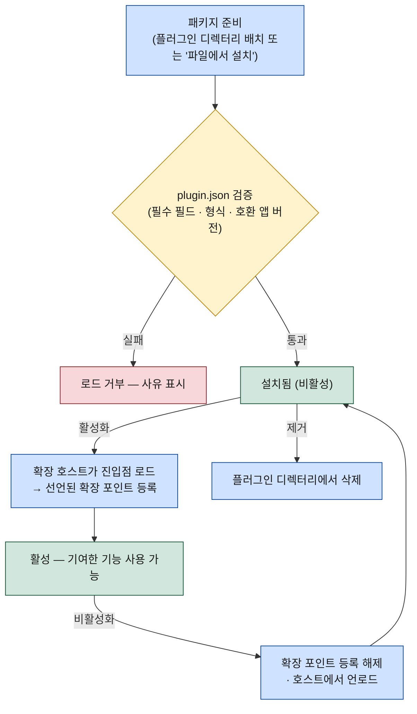

# WorkDeck 플러그인 시스템

이 문서는 WorkDeck 플러그인 시스템의 설계를 명세한다. 플러그인·확장 포인트·확장 호스트·매니페스트의 개념, 코어가 공식적으로 열어 두는 확장 포인트 4종, 확장 호스트 프로세스 기반 실행 모델([ADR-0002](../.forge/adr/0002-plugin-extension-host.md)), 매니페스트(plugin.json) 필드 정의, 로컬 설치와 수명주기를 다룬다. 용어 정의는 프로젝트 용어집(`.forge/CONTEXT.md`)과 [01-overview.md](01-overview.md)의 핵심 개념 표를 전제로 하고, 프로세스·모듈 구조는 [03-architecture.md](03-architecture.md)를 기준으로 한다.

## 1. 개요 — 코어는 작게, 기능 추가는 플러그인으로

플러그인은 WorkDeck에 기능을 추가하는 외부 설치 단위다. WorkDeck은 VSCode식 UI 모델을 차용한 것과 같은 이유로 확장 모델도 VSCode식을 따른다 — 코어는 핵심 가치("사이드바에서 고르고 워크스페이스의 콘텐츠 탭에서 작업한다")를 완결하는 최소 집합으로 유지하고, 그 밖의 기능 추가는 코어가 공식적으로 열어 둔 확장 포인트에 플러그인을 끼우는 방식으로 해결한다.

이 방식이 해결하는 문제는 로드맵에 이미 쌓여 있다. PDF·영상/오디오·압축파일 미리보기, 웹 브라우저 탭 같은 [04-roadmap.md](04-roadmap.md)의 2차 이후 항목들은 코어를 키우지 않고도 각각 해당 확장 포인트의 플러그인으로 구현될 수 있다. 코어 팀이 모든 파일 타입과 모든 프로토콜을 직접 지원하는 대신, 안정된 확장 포인트 계약을 제공하는 데 집중한다.

**위상**: 플러그인 시스템의 구현은 2차 마일스톤이다 — MVP 범위에는 포함되지 않으며, MVP 범위는 이 문서로 인해 바뀌지 않는다. 다만 확장 포인트 개념은 아키텍처에 지금부터 반영된다. 코어 모듈(미리보기·연결·워크스페이스)이 처음부터 확장 가능한 경계로 설계되어야, 2차에서 플러그인 시스템을 얹을 때 코어를 다시 쪼개는 비용이 들지 않기 때문이다.

## 2. 확장 포인트 4종

확장 포인트는 플러그인이 기능을 끼워 넣을 수 있도록 코어가 공식적으로 열어 둔 지점이다. WorkDeck의 확장 포인트는 아래 네 가지이며, 이 목록에 없는 지점으로는 플러그인이 코어에 개입할 수 없다.

| # | 확장 포인트 | 확장 대상 | 플러그인이 제공해야 하는 것 | 대응 코어 모듈 |
|---|-------------|-----------|------------------------------|----------------|
| ① | **미리보기 렌더러** | 새 파일 타입의 미리보기 추가 (예: PDF·영상/오디오·압축파일) | 담당 파일 타입 판별 기준(확장자 등)과 해당 타입의 읽기 전용 렌더러 — 단, 렌더러의 출력은 **실행 가능한 UI가 아니라 중간 표현(코어가 안전하게 그리는 데이터)**이다. 즉 플러그인은 "이 타입은 이렇게 표시해라"를 데이터로 반환하고, 실제 렌더링은 코어가 한다. | renderer 미리보기 모듈 ([03-architecture.md](03-architecture.md) 2.4절) |
| ② | **연결 프로토콜** | 새 원격 프로토콜 추가 (예: S3·WebDAV) | 프로토콜 식별자와 연결 수립·해제, 원격 디렉터리 목록·파일 읽기·전송 스트림 구현 | main 연결 모듈 ([03-architecture.md](03-architecture.md) 2.2절) |
| ③ | **콘텐츠 탭 + 사이드바 뷰** | 새 작업 도구 추가 (예: 웹 브라우저 탭) | 콘텐츠 탭/뷰의 내용 UI와 수명 처리(생성·포커스·닫기), 같은 대상 판정 기준. UI 기여 방식이 [ADR-0002](../.forge/adr/0002-plugin-extension-host.md)에서 아직 유보된 결정이므로, 이 포인트의 공개는 그 결정 이후로 미룬다. | renderer 사이드바·워크스페이스 UI ([02-ui-layout.md](02-ui-layout.md)) |
| ④a | **명령·컨텍스트 메뉴** | 앱 동작의 세부 확장 | 명령 정의(식별자·핸들러), 컨텍스트 메뉴 항목 | renderer 전역 UI (명령·메뉴 처리, [02-ui-layout.md](02-ui-layout.md) 6장의 디자인 관습 준수) |
| ④b | **테마** | 외관 확장 | 테마 정의(색 팔레트 등의 선언적 기여) | renderer 전역 UI. **테마는 선언적 기여라 확장 호스트의 진입점(`main`)이 필요 없다** — 매니페스트의 테마 선언만으로 renderer가 적용한다. |

### 2.1 2차 내 도입 권장 순서와 공개 위상

확장 포인트 하나를 공개한다는 것은 그 API 계약을 플러그인들에 대해 안정적으로 유지하겠다는 약속이다. 네 포인트를 한꺼번에 공개하면 계약 설계·안정화 부담이 한 시점에 몰리므로, 계약 표면이 좁은 것부터 순서대로 공개해 부담을 분산한다.

- **① 미리보기 렌더러 먼저** — 계약이 가장 좁다(입력: 파일 내용, 출력: 코어가 그리는 중간 표현). ①이 UI 기여(③)와 다른 점은, 플러그인이 renderer에 직접 UI를 기여하지 않고 데이터만 반환하므로 [ADR-0002](../.forge/adr/0002-plugin-extension-host.md)가 유보한 "UI 기여 방식" 결정에 의존하지 않는다는 것이다. 게다가 로드맵에 이미 배치된 향후 과제(PDF·영상/오디오·압축파일 미리보기)를 즉시 해소하므로 첫 계약의 검증 대상이 명확하다.
- **② 연결 프로토콜** — main 쪽 계약이지만, 기존 연결 모듈이 ssh2/basic-ftp를 다루며 쓰는 내부 인터페이스(수립·목록·전송 스트림)를 공개 계약으로 굳히는 일이라 형태가 이미 잡혀 있다.
- **③ 콘텐츠 탭 + 사이드바 뷰** — UI 기여는 계약 표면이 가장 넓다. UI 기여 방식의 상세는 [ADR-0002](../.forge/adr/0002-plugin-extension-host.md)에서 구현 단계 결정으로 미뤄져 있으므로, **그 결정이 내려진 뒤에만 공개한다** — ③(과 그에 종속되는 ④a)의 "2차 공개 확정"은 선행 조건이 해소되면 자동으로 성립하는 조건부 확정이다.
- **④a 명령·컨텍스트 메뉴** — ③과 같은 UI 기여 범주라 같은 조건에 묶인다. 앱 전역에 닿는 표면이라 ③의 계약이 안정된 뒤에 여는 것이 안전하다.
- **④b 테마** — 선언적 기여라 확장 호스트 실행 모델과 무관하므로, ② 직후 어느 시점에든 독립적으로 공개할 수 있다 (①·②와 함께 가장 먼저 열어도 무방하다).

## 3. 실행 모델 — 확장 호스트 프로세스

실행 모델의 결정 근거는 [ADR-0002](../.forge/adr/0002-plugin-extension-host.md)다. 플러그인 코드는 main도 renderer도 아닌 별도의 전용 Node 프로세스, 즉 **확장 호스트**에서 실행된다. main의 플러그인 관리자가 확장 호스트를 생성·감시하고, 플러그인은 공개된 WorkDeck API(IPC)로 앱과 통신한다. 채택 이유는 두 가지가 결합된 것이다.

1. **크래시 격리** — 플러그인이 죽어도 죽는 것은 확장 호스트 프로세스뿐이다. main이 이를 감지해 호스트를 재시작하며, 앱 본체는 영향을 받지 않는다.
2. **API 계약 강제(설계 규율, 보안 경계 아님)** — 프로세스 경계가 곧 API 경계다. 플러그인은 IPC로 공개된 WorkDeck API 외에는 코어 내부에 *물리적으로* 접근할 수 없어, 계약 우회가 구조적으로 차단된다. 단, 이것은 **API 표면**에 대한 강제일 뿐 OS 자원에 대한 샌드박스가 아니다 — 아래 3.1절의 신뢰 모델 참조.

비용은 구현 복잡도와 IPC 오버헤드이며, 이를 감수하기로 한 판단도 ADR-0002에 기록되어 있다. 대안(main 프로세스 내 직접 로드, 하이브리드 모델)의 기각 사유도 같은 문서를 따른다. 플러그인이 기여한 UI(미리보기 렌더링 결과, 콘텐츠 탭 내용 등)를 renderer에 반영하는 상세 방식은 ADR-0002를 깨지 않는 범위에서 구현 단계에 정한다.

### 3.1 신뢰 모델 — 플러그인은 완전 신뢰 코드

확장 호스트는 OS 샌드박스나 Node API 제한이 걸린 제한 런타임이 **아니다**. 그 안의 플러그인 코드는 일반 Node 프로세스처럼 `fs`·`net` 등 OS 자원에 자유롭게 접근할 수 있다. 따라서 **플러그인은 설치한 사용자가 완전히 신뢰하는 코드로 취급한다** — 이것은 VSCode가 채택한 것과 같은 모델이다.

이 신뢰 모델의 직접적 귀결: **매니페스트의 `permissions` 선언은 보안 강제가 아니라 사용자 고지용 메타데이터다.** "로컬 파일 읽기", "네트워크 접근" 같은 권한을 선언하지 않았다고 해서 확장 호스트의 플러그인이 `fs`·`net`을 쓰지 못하게 막을 수는 없다 — 프로세스 경계는 WorkDeck *API*만 강제할 뿐 OS 자원은 강제하지 않는다(3장 2항). 따라서:

- `permissions`의 역할은 **설치 시 사용자에게 "이 플러그인이 무엇을 요구하는지"를 보여주는 동의 화면의 근거**다. 선언과 실제 행위가 어긋나는 플러그인은 이 동의를 위반한 것이지, 기술적으로 차단된 것이 아니다.
- 문서·UI에서 "선언 범위 밖의 호출을 경계에서 거부한다"는 표현은 *WorkDeck API 호출*에만 해당하며, OS 자원 접근까지 포함하지 않는다. 이 구분을 명시하지 않으면 허위 보안 주장이 되므로, 본 문서와 [03-architecture.md](03-architecture.md)는 이 경계를 분리해 기술한다.

OS 자원 수준의 진짜 격리(제한 런타임, OS 프로세스 샌드박스 등)가 필요해지면 그것은 [ADR-0002](../.forge/adr/0002-plugin-extension-host.md)를 개정하는 별도 설계 결정이다 — 현재 범위에서는 채택하지 않는다(비용이 크고, 로컬 설치만 지원하는 v1에서 완전 신뢰 모델이면 충분하다는 판단).

아래 다이어그램이 세 프로세스의 관계다. renderer↔main의 기존 IPC 경계(preload 컨텍스트 브리지, [03-architecture.md](03-architecture.md) 1장)는 그대로 유지되고, 확장 호스트↔main 사이에 공개 WorkDeck API라는 두 번째 IPC 경계가 추가되는 구조다.

## 4. 매니페스트 (plugin.json)

매니페스트는 플러그인의 자기 선언 파일이다. 플러그인 패키지의 루트에 plugin.json으로 위치하며, 아래 필드를 담는다. 필수 필드가 없거나 형식이 어긋나면 그 패키지는 플러그인으로 로드되지 않는다(5장).

| 필드 | 필수 | 설명 |
|------|------|------|
| `id` | 필수 | 플러그인의 고유 식별자. 설치 중복 판정·비활성화·제거의 기준 키. |
| `name` | 필수 | 사용자에게 표시되는 플러그인 이름. |
| `version` | 필수 | 플러그인 자신의 버전(semver). 같은 `id`의 재설치 시 교체 판단에 쓴다. |
| `main` | 필수 | 진입점 — 확장 호스트가 활성화 시 로드하는 스크립트 파일 경로(패키지 루트 기준). |
| `extensionPoints` | 필수 | 사용하는 확장 포인트 선언(2장의 4종 중 하나 이상). 선언하지 않은 확장 포인트에는 기여할 수 없다. |
| `permissions` | 필수 | 요구 권한 선언(예: 로컬 파일 읽기, 네트워크 접근). **설치 시 사용자 동의 화면에 표시되는 고지용 메타데이터**다 — 보안 강제가 아니다(3.1절 신뢰 모델). 선언 범위 밖의 *WorkDeck API* 호출은 경계에서 거부되지만, OS 자원 접근까지 막지는 않는다. 필요 권한이 없으면 빈 목록으로 선언한다. |
| `engines.workdeck` | 필수 | 호환 앱 버전 범위. 현재 WorkDeck 버전이 범위 밖이면 로드가 거부된다. |
| `description` | 선택 | 플러그인 설명(설치 목록에 표시). |
| `author` | 선택 | 제작자 정보. |

매니페스트는 실행 전에 읽히는 선언이라는 점이 핵심이다. 플러그인 관리자는 코드를 한 줄도 실행하기 전에 매니페스트만으로 "이 플러그인이 어디에 무엇을 끼우고 무엇을 요구하는지"를 판정한다. 확장 포인트 선언은 실제 기여의 허용 범위가 되지만(3장 2항), `permissions`는 사용자 동의 화면의 근거일 뿐 실행을 기계적으로 막지는 않는다(3.1절).

## 5. 설치와 수명주기

### 5.1 로컬 설치

배포·설치는 로컬 설치만 지원한다. 설치 경로는 두 가지다.

1. **플러그인 디렉터리 배치** — userData 아래 플러그인 디렉터리에 플러그인 패키지를 직접 놓는다. 앱이 시작 시(또는 디렉터리 재검사 시) 이를 발견한다.
2. **앱 내 "파일에서 설치"** — 앱 UI에서 플러그인 패키지 파일을 선택하면 앱이 검증 후 플러그인 디렉터리로 복사한다.

두 경로 모두 이후 절차는 동일하다. 원격 레지스트리에서 받아오는 설치(마켓플레이스)는 이 명세의 범위 밖이다(6장).

### 5.2 설치 → 로드 → 활성화, 그리고 비활성화·제거

설치된 패키지는 먼저 매니페스트 검증(필수 필드·형식·호환 앱 버전)을 통과해야 플러그인으로 인정된다. 검증 실패 시 그 패키지는 로드되지 않고 사유가 표시된다. 검증을 통과한 플러그인은 활성화 시점에 확장 호스트가 진입점(`main`)을 로드하고, 매니페스트에 선언된 확장 포인트를 코어에 등록하면서 기능이 실제로 나타난다 — 예를 들어 ① 미리보기 렌더러 플러그인이 활성화되면 해당 파일 타입이 그 시점부터 미리보기 탭으로 열린다.

비활성화는 설치를 유지한 채 등록을 해제하고 확장 호스트에서 코드를 내리는 것이고, 제거는 플러그인 디렉터리에서 패키지 자체를 삭제하는 것이다. 활성 상태의 플러그인이 크래시하면 3장의 격리 모델에 따라 앱은 살아남고 확장 호스트가 재시작된다.

## 6. 향후 과제

마켓플레이스(원격 레지스트리·검색·자동 업데이트)는 이 명세의 범위 밖이며, 향후 과제로서의 배치는 [04-roadmap.md](04-roadmap.md)를 따른다.

## 7. 관련 문서

- [01-overview.md](01-overview.md) — 제품 개요, 핵심 개념 정의, 문서 세트 목차
- [02-ui-layout.md](02-ui-layout.md) — 사이드바·워크스페이스·콘텐츠 탭 구조 (확장 포인트 ③·④의 UI 전제)
- [03-architecture.md](03-architecture.md) — main/renderer 프로세스 구조와 IPC 경계, 코어 모듈 구성
- [04-roadmap.md](04-roadmap.md) — 마일스톤 배치와 향후 과제
- [features/preview.md](features/preview.md) — 미리보기 탭 MVP 범위와 미지원 타입 동작 (확장 포인트 ①의 대상 영역)
- [features/connections.md](features/connections.md) — 연결 프로필과 프로토콜 (확장 포인트 ②의 대상 영역)
- [ADR-0002](../.forge/adr/0002-plugin-extension-host.md) — 확장 호스트 프로세스 실행 모델 채택 근거
- [ADR-0001](../.forge/adr/0001-electron-over-tauri.md) — Electron + TypeScript 스택 채택 근거
