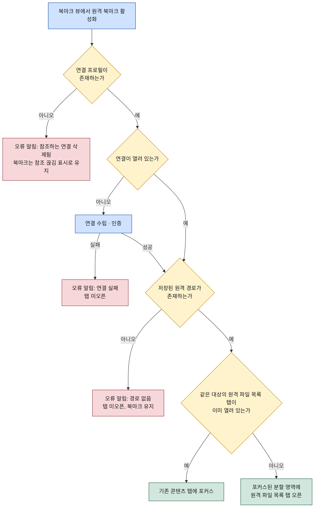

# 북마크

이 문서는 WorkDeck의 북마크 기능을 명세한다. 북마크는 저장해 둔 위치(로컬 또는 원격 경로)의 바로가기로, 사이드바의 북마크 뷰에 목록으로 표시되며 활성화하면 해당 경로의 파일 목록 탭이 열린다(원격 경로는 해당 연결의 원격 파일 목록 탭). 북마크의 데이터 정의, 열기 동작 규칙(연결이 닫혀 있거나 연결 프로필이 삭제된 경우 포함), 추가·삭제·정렬 규칙을 다룬다. 화면 구조와 탭 오픈 규칙은 [02-ui-layout.md](../02-ui-layout.md)를, 연결 프로필은 [connections.md](connections.md)를 전제로 한다.

## 1. 북마크 개념

북마크는 자주 가는 위치를 한 번의 활성화로 다시 여는 바로가기다. 대상은 두 종류다.

- **로컬 경로** — 로컬 파일시스템의 폴더. 활성화하면 그 경로의 파일 목록 탭이 열린다.
- **원격 경로** — 특정 연결(Connection)의 원격 파일시스템 폴더. 활성화하면 그 연결의 원격 파일 목록 탭이 해당 경로로 열린다.

북마크의 대상은 항상 **폴더 경로**다. 북마크 활성화의 결과는 언제나 파일 목록 탭(로컬/원격)이며, 파일 단위 북마크는 지원하지 않는다(MVP 범위). 이는 [02-ui-layout.md 3장](../02-ui-layout.md)의 타입별 탭 오픈 규칙 — "북마크 → 저장된 경로의 파일 목록 탭" — 과 일치한다.

북마크는 사이드바의 북마크 뷰에서 관리한다. 북마크 뷰는 저장된 북마크를 사용자가 정한 순서대로 나열하는 목록 화면이며, 다른 뷰와 마찬가지로 1차 선택·탐색까지만 담당한다 — 실제 작업은 워크스페이스의 콘텐츠 탭에서 일어난다.

## 2. 북마크 데이터 정의

북마크 하나는 아래 필드로 구성된다. 종류(로컬/원격)에 따라 연결 참조 필드의 유무가 갈린다.

| 필드 | 로컬 북마크 | 원격 북마크 |
|------|-------------|-------------|
| **이름** | 사용자 지정 표시 이름. 기본값은 대상 폴더 이름 | 동일 |
| **종류** | `local` | `remote` |
| **경로** | 로컬 파일시스템의 폴더 절대 경로 | 원격 파일시스템의 폴더 절대 경로 |
| **연결 참조** | 없음 | 참조하는 연결 프로필의 식별자 |

규칙:

- **연결 참조는 식별자로 한다.** 원격 북마크는 연결 프로필을 이름이 아니라 프로필 식별자로 참조한다. 연결 프로필의 이름·호스트 등을 수정해도 북마크는 깨지지 않으며, 프로필이 삭제된 경우에만 참조가 끊긴다(3.3절).
- **북마크는 시크릿을 갖지 않는다.** 원격 북마크는 연결 프로필을 가리킬 뿐, 인증 정보는 연결 쪽 소관이다([connections.md](connections.md), [03-architecture.md 4장](../03-architecture.md)).
- **중복 금지.** 같은 대상(로컬: 경로 동일, 원격: 연결 참조와 경로 모두 동일)의 북마크는 하나만 존재한다. 추가 시점에 검사한다(4.1절).
- **저장 위치.** 북마크 목록은 앱 설정과 함께 Electron userData 디렉터리의 설정 파일에 저장한다([03-architecture.md 4.1](../03-architecture.md)). 목록의 순서도 함께 저장되어 재시작 후 유지된다.

## 3. 열기 동작 규칙

### 3.1 공통 규칙

북마크 뷰에서 북마크를 활성화하면 종류에 따라 로컬 또는 원격 파일 목록 탭이 열린다. 이때 [02-ui-layout.md 3장](../02-ui-layout.md)의 탭 오픈 공통 규칙이 그대로 적용된다.

- **중복 검사** — 같은 대상의 파일 목록 탭이 이미 열려 있으면 새 탭을 만들지 않고 기존 콘텐츠 탭에 포커스한다. "같은 대상" 판정은 북마크가 아니라 결과 탭 기준이다: 로컬은 폴더 경로, 원격은 연결 프로필 + 경로. 따라서 사이드바의 파일 뷰에서 연 탭과 북마크로 연 탭은 대상이 같으면 같은 탭이다.
- **새 탭 위치** — 새 탭이 필요한 경우 현재 포커스된 분할 영역에 열린다.

### 3.2 로컬 북마크 열기

로컬 북마크를 활성화하면 저장된 경로의 존재를 확인한 뒤 파일 목록 탭을 연다. 경로가 더 이상 존재하지 않으면(폴더 삭제·이동·볼륨 미마운트) 탭을 열지 않고 실패 사유를 알린다. 북마크 자체는 자동 삭제하지 않는다 — 삭제 여부는 사용자가 북마크 뷰에서 결정한다(4.2절).

```
로컬 북마크 활성화 → 경로 존재 확인 → 파일 목록 탭 오픈 규칙 적용(중복 검사 → 포커스 또는 새 탭)
                          ↓ 경로 없음
                     오류 알림 (탭 미오픈, 북마크 유지)
```

### 3.3 원격 북마크 열기

원격 북마크는 참조하는 연결의 상태에 따라 세 갈래로 갈린다.

1. **연결이 이미 열려 있는 경우** — 그 연결로 저장된 경로의 원격 파일 목록 탭을 연다(중복 검사 포함).
2. **연결이 닫혀 있는 경우** — 먼저 연결을 수립한 뒤(인증은 main의 연결 모듈이 수행, [connections.md](connections.md)) 원격 파일 목록 탭을 연다. 연결 수립에 실패하면(호스트 불가·인증 실패 등) 탭을 열지 않고 실패 사유를 알린다.
3. **연결 프로필이 삭제된 경우** — 참조가 끊긴 상태다. 탭을 열지 않고 "참조하는 연결이 삭제되었다"는 오류를 알린다. 북마크는 자동 삭제하지 않고 북마크 뷰에서 참조 끊김 상태로 표시하며, 사용자가 직접 삭제한다(4.2절).

연결 수립 후 원격 경로가 존재하지 않는 경우(서버에서 폴더가 삭제된 경우)의 동작은 로컬과 동일하다 — 탭을 열지 않고 실패 사유를 알리며, 북마크는 유지한다.



## 4. 추가 · 삭제 · 정렬

### 4.1 추가

북마크는 파일 목록 탭(로컬)과 원격 파일 목록 탭에서 **"현재 경로 북마크 추가"** 명령으로 추가한다(컨텍스트 메뉴 및 단축키 — 키맵은 구현 단계에서 [02-ui-layout.md 5장](../02-ui-layout.md)의 방침에 따라 확정). 탭이 현재 표시 중인 폴더 경로가 대상이 되며, 원격 파일 목록 탭에서는 그 탭의 연결 프로필이 연결 참조로 함께 기록된다.

추가 절차는 선형이며 중복 분기 하나만 있다.

```
"현재 경로 북마크 추가" 실행 → 중복 검사 → 이름 입력(기본값: 폴더 이름) → 북마크 뷰 목록 맨 아래에 추가 → 저장
                                   ↓ 같은 대상이 이미 북마크됨
                              알림 후 기존 북마크를 북마크 뷰에서 강조 (추가 안 함)
```

새 북마크는 항상 목록 맨 아래에 추가된다 — 자동 정렬은 없다(4.3절).

### 4.2 삭제

삭제는 사이드바의 북마크 뷰에서만 한다. 북마크 항목의 컨텍스트 메뉴에서 "삭제"를 실행하면 해당 북마크가 목록과 저장 파일에서 제거된다. 삭제는 북마크 데이터만 제거한다 — 대상 폴더, 연결 프로필, 이미 열려 있는 콘텐츠 탭에는 아무 영향이 없다.

참조 끊김 상태(3.3절)의 북마크도 같은 방식으로 삭제한다. 연결 프로필이 삭제되어도 그 프로필을 참조하던 북마크가 자동 삭제되지는 않는다 — 사용자가 프로필을 다시 만들 수도 있으므로, 정리 여부는 사용자의 결정으로 남긴다.

### 4.3 정렬

북마크 목록의 순서는 전적으로 사용자가 정한다. 이름순·종류순 같은 자동 정렬은 제공하지 않으며(MVP 범위), 북마크 뷰에서 항목을 드래그해 원하는 위치로 옮기는 **수동 정렬**만 지원한다. 변경된 순서는 즉시 저장되어 재시작 후에도 유지된다(2장의 저장 규칙).

## 5. 관련 문서

- [02-ui-layout.md](../02-ui-layout.md) — 사이드바 뷰 전환, 타입별 탭 오픈 규칙(중복 검사·분할 영역), 키보드 조작 방침
- [connections.md](connections.md) — 연결 프로필 필드 정의, 연결 수립과 "파일로 열기" 액션
- [file-manager.md](file-manager.md) — 파일 목록 탭(로컬/원격)의 탐색·정렬·파일 작업
- [03-architecture.md](../03-architecture.md) — 설정·북마크 저장 위치와 시크릿 보관 방침
- [01-overview.md](../01-overview.md) — 핵심 개념 정의와 문서 세트 목차
