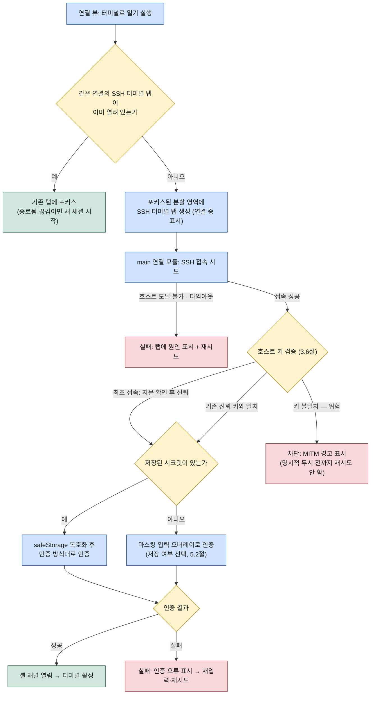
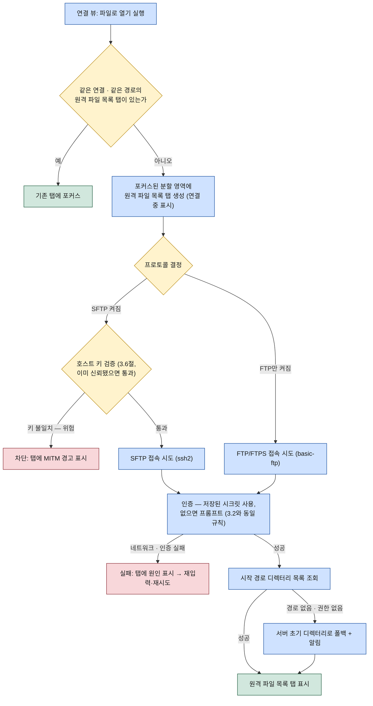

# WorkDeck 연결 (Connections)

이 문서는 연결 — SSH/SFTP/FTP 접속 정보를 하나로 담는 통합 프로필 — 을 명세한다. 연결 프로필의 필드 정의, 하나의 연결을 여는 두 가지 액션("터미널로 열기" → SSH 터미널 탭, "파일로 열기" → 원격 파일 목록 탭)과 각 액션의 연결·인증 흐름, 사이드바 연결 뷰에서의 프로필 CRUD, 비밀번호·패스프레이즈의 시크릿 보관 방침을 다룬다. 화면 구조와 콘텐츠 탭 오픈 규칙은 [02-ui-layout.md](../02-ui-layout.md)를, 연결 모듈의 프로세스·라이브러리 구성은 [03-architecture.md](../03-architecture.md)를 전제로 한다.

## 1. 연결 개념

연결은 원격 서버 접속 정보를 담는 **통합 프로필**이다. 기존 도구들이 같은 서버의 SSH 계정과 FTP 계정을 별개 앱·별개 항목으로 관리하게 만드는 것과 달리, WorkDeck은 서버 하나당 프로필 하나를 원칙으로 한다. 하나의 연결이 지원 프로토콜에 따라 두 방식으로 열린다.

- **터미널로 열기** — SSH 셸 세션을 여는 액션. 결과는 SSH 터미널 탭.
- **파일로 열기** — SFTP 또는 FTP/FTPS 세션으로 원격 파일시스템을 여는 액션. 결과는 원격 파일 목록 탭.

같은 연결에서 SSH 터미널 탭과 원격 파일 목록 탭은 서로 다른 대상이므로 동시에 열려 공존할 수 있다([02-ui-layout.md 3장](../02-ui-layout.md)의 중복 판정 기준). 연결의 수립·유지·해제는 main 프로세스의 연결 모듈이 소유하며, 프로토콜별 구현은 ssh2(SSH 셸·SFTP)와 basic-ftp(FTP/FTPS)로 나뉜다([03-architecture.md 2.2절](../03-architecture.md)). S3·WebDAV 같은 새 프로토콜은 연결 프로토콜 확장 포인트를 통해 플러그인으로 추가될 수 있다 — [05-plugin-system.md](../05-plugin-system.md) 참조.

## 2. 연결 프로필 필드 정의

연결 프로필은 아래 필드로 구성된다. 시크릿(비밀번호·패스프레이즈)은 프로필 본문에 포함되지 않는다 — 5장의 보관 방침을 따른다.

| 필드 | 키 (예시) | 타입 | 필수 | 기본값 | 설명 |
|------|-----------|------|------|--------|------|
| 식별자 | `id` | string (UUID) | 자동 | 생성 시 부여 | 내부 식별자. 콘텐츠 탭의 "같은 대상" 판정과 북마크의 원격 경로 참조에 사용. 변경 불가 |
| 이름 | `name` | string | 필수 | — | 연결 뷰에 표시되는 이름. 프로필 간 중복 불가 |
| 호스트 | `host` | string | 필수 | — | 호스트명 또는 IP 주소 |
| SSH/SFTP 포트 | `sshPort` | number | 선택 | `22` | SSH·SFTP 공용 포트 |
| FTP/FTPS 포트 | `ftpPort` | number | 선택 | `21` | FTP·FTPS 공용 포트 |
| SSH 지원 | `protocols.ssh` | boolean | 선택 | `true` | "터미널로 열기" 가능 여부 |
| SFTP 지원 | `protocols.sftp` | boolean | 선택 | `true` | "파일로 열기"에서 SFTP 사용 여부 |
| FTP 지원 | `protocols.ftp` | boolean | 선택 | `false` | "파일로 열기"에서 FTP 사용 여부 |
| FTPS 사용 | `protocols.ftps` | boolean | 선택 | `false` | FTP 접속 시 TLS 사용(FTPS). `ftp`가 켜진 경우에만 유효 |
| 사용자명 | `username` | string | 필수 | — | 로그인 계정 |
| 인증 방식 | `authMethod` | `password` \| `privateKey` | 필수 | `password` | SSH/SFTP에 적용. FTP/FTPS는 항상 비밀번호 인증 |
| 키 파일 경로 | `privateKeyPath` | string | 조건부 | — | `authMethod = privateKey`일 때 필수. 개인 키 **파일의 경로**만 저장하고 키 내용은 저장하지 않음 |
| 기본 원격 경로 | `defaultRemotePath` | string | 선택 | — | "파일로 열기"의 시작 경로. 비워 두면 서버가 정하는 초기 디렉터리 |
| FTP 전용 사용자명 | `ftpUsername` | string | 선택 | `username`과 동일 | SSH/SFTP 계정과 FTP 계정이 분리된 서버(공유 호스팅 등)를 위한 오버라이드. 비우면 `username`을 그대로 쓴다 |
| FTP 전용 비밀번호 저장 여부 | (시크릿, 본문에 값 없음) | — | 선택 | — | FTP 전용 시크릿을 별도로 저장했는지 여부만 프로필에 남는다(5장). 없으면 공용 비밀번호를 쓴다 |
| 파일명 인코딩 | `filenameEncoding` | `auto` \| `utf8` \| `euc-kr` | 선택 | `auto` | 원격 파일명·경로의 인코딩. `auto`는 FTP의 UTF8 협상(FEAT/OPTS UTF8)을 먼저 시도하고 실패하면 지정 인코딩으로 폴백한다(3.6절) |

유효성 규칙:

1. `protocols`의 SSH·SFTP·FTP 중 최소 하나는 켜져 있어야 한다.
2. `protocols.ssh = false`인 프로필은 "터미널로 열기"가 비활성화되고, SFTP·FTP가 모두 꺼진 프로필은 "파일로 열기"가 비활성화된다.
3. `authMethod = privateKey`이면 `privateKeyPath`가 있어야 저장할 수 있다.
4. 비밀번호와 개인 키 패스프레이즈는 이 프로필 본문 어디에도 저장하지 않는다(5장).
5. FTP 전용 인증 정보는 SSH/SFTP 인증 방식(비밀번호/개인 키)과 무관하게 항상 비밀번호 인증이다 — `authMethod`는 SSH/SFTP에만 적용된다(2장 표의 정의 그대로).

## 3. 두 가지 열기 액션

### 3.1 액션 선택 UI

연결 뷰의 항목은 활성화 시 하나의 결과로 직행하지 않으므로([02-ui-layout.md 2.2절](../02-ui-layout.md)), 액션 선택 방식을 다음과 같이 정한다.

- **더블클릭 / Enter** — 기본 액션 실행. 기본 액션은 SSH를 지원하는 프로필이면 "터미널로 열기", SSH를 지원하지 않는 프로필(FTP/SFTP 전용)이면 "파일로 열기"다.
- **컨텍스트 메뉴(우클릭)** — "터미널로 열기"와 "파일로 열기"를 항상 모두 노출하되, 프로토콜 지원 여부에 따라 비활성 항목은 흐리게 표시한다. 프로필 수정·삭제·복제(4장)도 이 메뉴에서 실행한다.

### 3.2 터미널로 열기 (SSH 터미널 탭)

"터미널로 열기"는 SSH 셸 세션을 열어 SSH 터미널 탭을 만든다. 절차는 다음과 같다. 먼저 워크스페이스 전체에서 같은 연결의 SSH 터미널 탭이 이미 있는지 중복 검사를 하고, 있으면 기존 탭에 포커스하고 끝낸다(탭이 "종료됨" 또는 "끊김" 상태여도 그 탭에 포커스한 뒤 이어서 새 세션을 시작한다 — [features/terminal.md](terminal.md) 5.2·5.3절). 없으면 포커스된 분할 영역에 "연결 중" 상태의 SSH 터미널 탭을 먼저 만들고, main의 연결 모듈이 SSH 접속을 시도한다. 접속에 성공하면 **호스트 키 검증**을 거친다(3.6절) — 처음 접속하는 호스트면 키 지문을 탭 안에 표시하고 사용자 확인을 받아 신뢰 저장소에 기록하며, 이미 신뢰된 호스트면 저장된 키와 대조한다. 키가 일치하지 않으면 접속을 즉시 차단하고 경고를 표시한다(사용자가 명시적으로 무시를 선택하지 않는 한 재시도하지 않는다). 검증을 통과하면 인증 단계로 넘어간다 — 저장된 시크릿이 있으면 safeStorage에서 복호화해 인증 방식(비밀번호 또는 개인 키+패스프레이즈)대로 인증하고, 저장된 시크릿이 없으면 5.2절의 마스킹 입력 오버레이로 사용자 입력을 받아 인증한다(이때 "저장" 여부를 함께 선택). 인증까지 성공하면 셸 채널이 열리고 탭이 터미널로 활성화된다. 호스트 도달 불가·타임아웃(네트워크 실패)이나 인증 실패 시에는 탭 안에 원인을 표시하고 재시도(인증 실패는 재입력)를 제공한다 — 탭 자체는 닫히지 않는다. 세션 수립 이후의 수명·종료·재연결 규칙은 [features/terminal.md](terminal.md)가 소관이다.



### 3.3 파일로 열기 (원격 파일 목록 탭)

"파일로 열기"는 원격 파일시스템 세션을 열어 원격 파일 목록 탭을 만든다. 시작 경로는 프로필의 기본 원격 경로이며, 비어 있으면 서버가 정하는 초기 디렉터리다. 절차는 다음과 같다. 먼저 중복 검사 — 같은 연결이면서 현재 표시 중인 경로가 시작 경로와 같은 원격 파일 목록 탭이 있으면 기존 탭에 포커스한다([02-ui-layout.md 3장](../02-ui-layout.md)의 판정 기준 그대로). 없으면 포커스된 분할 영역에 "연결 중" 상태의 원격 파일 목록 탭을 먼저 만들고(3.2절과 동일하게, 이후 실패도 이 탭 안에 표시하기 위함), 프로토콜을 결정한다: SFTP가 켜져 있으면 SFTP를 우선 사용하고, SFTP가 꺼진 프로필만 FTP(FTPS가 켜져 있으면 TLS)로 접속한다. SFTP는 3.2절과 동일하게 호스트 키 검증(3.6절)을 거친다 — SSH 터미널 탭에서 이미 같은 호스트를 신뢰했다면 재확인 없이 통과한다. 이후 인증은 3.2와 같은 규칙을 따른다 — SFTP는 SSH와 동일한 인증 방식(비밀번호/개인 키), FTP/FTPS는 `ftpUsername`/FTP 전용 시크릿이 있으면 그것을, 없으면 공용 비밀번호를 쓰며, 저장된 시크릿이 없으면 프롬프트로 입력받는다. 인증에 성공하면 시작 경로의 디렉터리 목록을 조회해 탭에 표시한다. 시작 경로가 존재하지 않거나 접근 권한이 없으면 서버 초기 디렉터리로 폴백하고 탭 안에 그 사실을 알린다. 네트워크·인증 실패 시의 표시와 재시도는 3.2와 동일하다. 목록 탐색·정렬·파일 작업은 [features/file-manager.md](file-manager.md)가 소관이며, 프로토콜별 동시성(같은 연결에서 전송 중 탐색이 가능한지)은 3.4절을 따른다.



### 3.4 연결 수명과 세션 모델

"연결"은 프로필이 아니라 **그 프로필로 맺은 살아있는 접속**을 가리키는 상태 개념이다. 하나의 연결 프로필에서 SSH 터미널 탭과 원격 파일 목록 탭이 동시에 열려 있어도 각 탭은 프로토콜에 따라 독립된 접속(SSH 셸 채널 vs SFTP/FTP 세션)을 갖는다 — "연결이 열려 있다"는 것은 그 프로필을 쓰는 탭이 하나 이상 활성 접속을 유지하고 있다는 뜻이다.

**열림/닫힘 전이**: 연결은 그 프로필을 쓰는 첫 탭이 접속에 성공하면 열리고, 그 프로필을 쓰는 모든 탭이 닫히면(또는 모든 탭이 끊김·종료됨 상태가 되면) 닫힌다. 유휴 타임아웃이나 명시적 "연결 끊기" 액션은 MVP에서 제공하지 않는다 — 탭이 살아있는 한 접속도 유지된다.

**프로토콜별 동시성**: SSH/SFTP는 하나의 SSH 접속 위에 여러 채널(셸 채널, SFTP 세션)을 다중화할 수 있으므로, 같은 연결의 SSH 터미널 탭과 원격 파일 목록 탭은 서로를 막지 않고 동시에 동작한다. **FTP는 다르다** — 제어 연결 하나가 한 번에 하나의 명령·전송만 처리할 수 있으므로, 같은 연결에서 전송이 진행 중인 동안 그 연결의 원격 파일 목록 탭(FTP 세션)은 목록 조회·탐색 요청을 전송 완료까지 **큐잉**한다(탭은 "처리 중" 표시를 보여준다 — 실패가 아니다). 전송과 탐색을 동시에 하려면 파일 관리자는 필요 시 같은 프로필로 두 번째 제어 연결을 수립한다 — 단, 서버가 계정당 동시 접속 수를 제한하는 경우(공유 호스팅에 흔함) 두 번째 접속이 거부될 수 있으며, 이때는 첫 연결로 강등해 큐잉 동작으로 폴백한다. 이 예외는 2.3절의 "진행 중에도 다른 탭 조작 가능" 원칙의 FTP 한정 보완 규칙이다.

| 프로토콜 | 같은 연결 내 동시 작업 | 근거 |
|----------|------------------------|------|
| SSH/SFTP | 가능 (채널 다중화) | 하나의 SSH 접속 위 다중 채널 |
| FTP/FTPS | 불가 — 큐잉 또는 보조 제어 연결로 대체 | 제어 연결당 1작업 (프로토콜 제약) |

### 3.5 파일 세션 끊김 감지와 재연결

원격 파일 목록 탭이 쓰는 SFTP/FTP 세션도 SSH 터미널 세션과 마찬가지로 끊길 수 있다(네트워크 오류, 유휴 타임아웃으로 인한 서버 측 종료 등). 감지·복구 규칙은 SSH 터미널의 끊김 규칙([features/terminal.md](terminal.md) 5.3절)과 대칭이다:

- 끊김이 감지되면 탭은 닫히지 않고 유지되며, 마지막으로 조회한 목록이 화면에 남는다. 탭 안에 끊김 알림과 "재연결" 버튼이 표시되고, 재연결 전까지 탐색·파일 작업은 비활성화된다.
- 재연결은 수동이 기본이다 — 버튼을 눌러야 재시도한다. 재연결에 성공하면 같은 경로로 목록을 다시 조회한다.
- **진행 중이던 파일 전송에 끊김이 발생하면**, 그 전송은 실패로 처리된다(3장 공통 제약). 끊긴 시점에는 원격의 미완성 파일을 제거할 수단이 없으므로 — 정리는 "즉시 보장"이 아니라 "재연결 성공 시 시도"다: 재연결에 성공하면 파일 관리자가 자동으로 정리를 시도하고, 재연결하지 않거나 정리가 실패하면 그 경로를 탭 안에 안내해 사용자가 직접 확인하게 한다.

### 3.6 호스트 신원 확인 (SSH/SFTP)

SSH·SFTP 접속은 최초 셸 채널이 열리기 전에 **호스트 키 검증**을 거친다(TOFU — Trust On First Use 방식). 처음 접속하는 호스트면 서버가 제시한 공개 키의 지문을 탭 안에 표시하고 사용자 확인을 받은 뒤, 그 키를 연결 프로필과 함께 로컬 신뢰 저장소(OS 키체인 계열, 5장과 동일한 보관 방식)에 기록한다. 이후 같은 연결로 접속할 때마다 서버가 제시한 키를 저장된 키와 대조하고, 일치하면 통과, **불일치하면 접속을 즉시 차단**하고 중간자 공격(MITM) 가능성을 경고한다 — 사용자가 대화상자에서 명시적으로 "위험을 감수하고 계속"을 선택하지 않는 한 자동 재시도하지 않는다. 같은 프로필에서 SSH 터미널과 SFTP(파일로 열기)는 같은 신뢰 저장소를 공유하므로, 한쪽에서 이미 신뢰한 호스트는 다른 쪽에서 재확인하지 않는다.

FTPS(FTP+TLS)는 다른 메커니즘을 쓴다 — 서버 인증서 검증에 실패하면(자체 서명·만료·호스트명 불일치) 기본적으로 접속을 차단하며, 예외를 허용하려면 프로필 단위로 명시적으로 켜야 한다.

## 4. 프로필 CRUD

프로필의 추가·수정·삭제·복제는 모두 사이드바의 연결 뷰에서 실행한다. 편집 폼은 2장의 필드를 노출하고, 유효성 규칙을 통과해야 저장된다.

| 동작 | 진입 | 규칙 |
|------|------|------|
| **추가** | 연결 뷰 상단의 추가 버튼 | 빈 편집 폼 → 필수 필드 입력 → 유효성 검사 통과 시 저장. 시크릿 입력은 선택 — 저장하지 않으면 연결할 때마다 프롬프트(5장) |
| **수정** | 항목 컨텍스트 메뉴 → 수정 | 편집 폼에 기존 값 로드(시크릿은 원문 대신 "저장됨" 상태만 표시). 저장된 수정은 **다음 연결 시도부터** 적용되며, 이미 열린 탭·세션에는 소급되지 않는다 |
| **삭제** | 항목 컨텍스트 메뉴 → 삭제 | 확인 다이얼로그를 거친다. 삭제 시 연관 시크릿도 함께 삭제한다. 이미 열린 콘텐츠 탭과 세션은 강제로 닫지 않되, 이후 재연결은 불가능해진다 |
| **복제** | 항목 컨텍스트 메뉴 → 복제 | 새 `id`를 부여하고 이름에 복제 표식(예: `이름 (복사)`)을 붙인 사본을 만든다. 저장된 시크릿도 함께 복제한다(같은 OS 사용자 계정 내 복제이므로 5장의 방침과 충돌하지 않는다) |

삭제의 확인 흐름:

```
삭제 실행 → 확인 다이얼로그 → 확인 → 프로필 + 연관 시크릿 삭제 → 연결 뷰 목록 갱신
                  ↓ 취소
              변경 없음
```

프로필 목록과 편집 결과는 설정 파일(JSON)로 저장된다 — 저장 위치와 파일 구성은 [03-architecture.md 4.1절](../03-architecture.md)을 따른다.

## 5. 시크릿 보관 방침

시크릿은 **비밀번호**(SSH/SFTP/FTP 공통, FTP 전용 비밀번호 포함)와 **개인 키 패스프레이즈** 두 가지다. 보관 원칙은 [03-architecture.md 4.2절](../03-architecture.md)의 방침을 그대로 따르며, 연결 기능 관점에서 다음과 같이 적용한다.

### 5.1 저장된 시크릿의 보관 원칙

1. **프로필 본문(JSON)에 평문 저장 금지** — 프로필 파일에는 시크릿 원문이 어떤 형태로도 들어가지 않는다. 프로필이 갖는 것은 "이 프로필에 시크릿이 저장되어 있는가" 여부뿐이다.
2. **safeStorage 암호화 보관** — 시크릿은 Electron `safeStorage`로 암호화해 보관한다. safeStorage는 OS 키체인 계열 저장소(macOS Keychain, Windows DPAPI, Linux libsecret)에서 파생한 키로 암호화하므로, 파일이 유출되어도 해당 OS 사용자 계정 밖에서는 복호화되지 않는다.
3. **저장된 시크릿은 main 밖으로 나가지 않는다** — 저장된 시크릿의 복호화와 그것을 사용하는 인증은 main의 연결 모듈 내부에서만 수행한다. renderer는 "이 프로필에 시크릿이 저장되어 있는가" 여부와 연결 성공/실패 결과만 받으며, 저장된 시크릿의 원문을 IPC로 전달받는 경로는 존재하지 않는다. (사용자가 그 자리에서 입력하는 시크릿은 저장된 시크릿이 아니다 — 5.2절.)
4. **저장은 선택** — 시크릿을 저장하지 않은 프로필도 유효하다. 이 경우 연결할 때마다 5.2절의 방식으로 입력받고, 입력 시 "저장"을 선택하면 그 시점에 safeStorage로 보관한다.
5. **개인 키 파일은 경로만** — `privateKeyPath`는 키 파일의 위치만 가리킨다. 키 파일 내용을 프로필이나 시크릿 저장소로 복사하지 않으며, 키 파일 자체의 보호는 사용자·OS의 책임이다.

### 5.2 사용자 입력 시크릿의 처리

저장된 시크릿이 없을 때 3.2·3.3절에서 요구하는 입력은 **터미널의 데이터 입력 스트림과 분리된 전용 마스킹 입력 오버레이**에서 받는다 — SSH 터미널 탭 안이라도 이 입력은 xterm.js의 키 입력 경로를 거치지 않으며, 터미널의 스크롤백·로그에도 기록되지 않는다. 오버레이에서 입력을 제출하면 그 값은 전용 IPC 채널로 **한 번** main에 전달되어 즉시 인증에 사용되고, renderer·main 양쪽 메모리에서 곧바로 폐기된다("저장" 선택 시에만 main이 safeStorage에 별도로 암호화 보관한다). 이 1회성 전달은 "저장된 시크릿은 IPC 경계를 넘지 않는다"(5.1절 3항)는 불변식의 예외가 아니라, 애초에 그 불변식이 다루는 대상이 아니다 — 사용자가 그 순간 입력한 값이 저장되지 않은 채 한 번 쓰이고 사라지는 것과, 이미 저장된 시크릿이 반복 유출되는 것은 다른 위협이다.

## 6. 관련 문서

- [02-ui-layout.md](../02-ui-layout.md) — 연결 뷰의 위치, 콘텐츠 탭 오픈·중복 판정 규칙
- [03-architecture.md](../03-architecture.md) — 연결 모듈(ssh2 · basic-ftp), 프로필 저장 위치, safeStorage 시크릿 보관
- [features/terminal.md](terminal.md) — SSH 터미널 탭의 세션 수명·종료·재연결
- [features/file-manager.md](file-manager.md) — 원격 파일 목록 탭의 탐색과 파일 작업
- [features/bookmarks.md](bookmarks.md) — 원격 경로 북마크가 연결을 참조해 열리는 규칙
- [ADR-0001](../../.forge/adr/0001-electron-over-tauri.md) — Electron + TypeScript 스택 채택 근거
