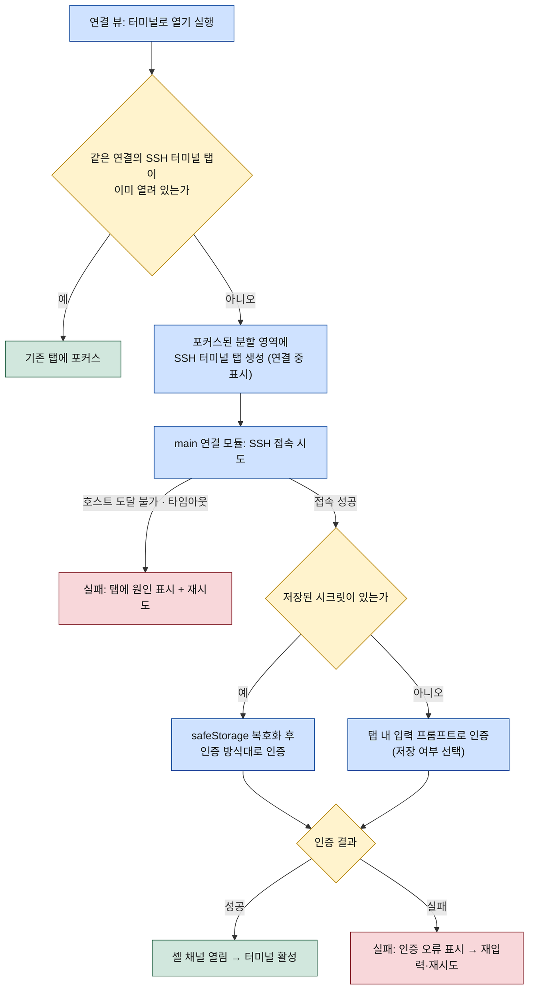
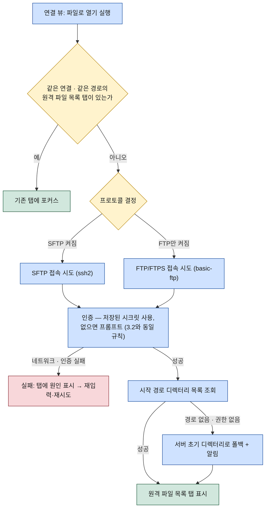

# WorkDeck 연결 (Connections)

이 문서는 연결 — SSH/SFTP/FTP 접속 정보를 하나로 담는 통합 프로필 — 을 명세한다. 연결 프로필의 필드 정의, 하나의 연결을 여는 두 가지 액션("터미널로 열기" → SSH 터미널 탭, "파일로 열기" → 원격 파일 목록 탭)과 각 액션의 연결·인증 흐름, 사이드바 연결 뷰에서의 프로필 CRUD, 비밀번호·패스프레이즈의 시크릿 보관 방침을 다룬다. 화면 구조와 콘텐츠 탭 오픈 규칙은 [02-ui-layout.md](../02-ui-layout.md)를, 연결 모듈의 프로세스·라이브러리 구성은 [03-architecture.md](../03-architecture.md)를 전제로 한다.

## 1. 연결 개념

연결은 원격 서버 접속 정보를 담는 **통합 프로필**이다. 기존 도구들이 같은 서버의 SSH 계정과 FTP 계정을 별개 앱·별개 항목으로 관리하게 만드는 것과 달리, WorkDeck은 서버 하나당 프로필 하나를 원칙으로 한다. 하나의 연결이 지원 프로토콜에 따라 두 방식으로 열린다.

- **터미널로 열기** — SSH 셸 세션을 여는 액션. 결과는 SSH 터미널 탭.
- **파일로 열기** — SFTP 또는 FTP/FTPS 세션으로 원격 파일시스템을 여는 액션. 결과는 원격 파일 목록 탭.

같은 연결에서 SSH 터미널 탭과 원격 파일 목록 탭은 서로 다른 대상이므로 동시에 열려 공존할 수 있다([02-ui-layout.md 3장](../02-ui-layout.md)의 중복 판정 기준). 연결의 수립·유지·해제는 main 프로세스의 연결 모듈이 소유하며, 프로토콜별 구현은 ssh2(SSH 셸·SFTP)와 basic-ftp(FTP/FTPS)로 나뉜다([03-architecture.md 2.2절](../03-architecture.md)). S3·WebDAV 같은 새 프로토콜은 연결 프로토콜 확장 포인트를 통해 플러그인으로 추가될 수 있다 — [05-plugin-system.md](../05-plugin-system.md) 참조.

## 2. 연결 프로필 필드 정의

연결 프로필은 아래 필드로 구성된다. 시크릿(비밀번호·패스프레이즈)은 프로필 본문에 포함되지 않는다 — 5장의 보관 방침을 따른다.

| 필드 | 키 (예시) | 타입 | 필수 | 기본값 | 설명 |
|------|-----------|------|------|--------|------|
| 식별자 | `id` | string (UUID) | 자동 | 생성 시 부여 | 내부 식별자. 콘텐츠 탭의 "같은 대상" 판정과 북마크의 원격 경로 참조에 사용. 변경 불가 |
| 이름 | `name` | string | 필수 | — | 연결 뷰에 표시되는 이름. 프로필 간 중복 불가 |
| 호스트 | `host` | string | 필수 | — | 호스트명 또는 IP 주소 |
| SSH/SFTP 포트 | `sshPort` | number | 선택 | `22` | SSH·SFTP 공용 포트 |
| FTP/FTPS 포트 | `ftpPort` | number | 선택 | `21` | FTP·FTPS 공용 포트 |
| SSH 지원 | `protocols.ssh` | boolean | 선택 | `true` | "터미널로 열기" 가능 여부 |
| SFTP 지원 | `protocols.sftp` | boolean | 선택 | `true` | "파일로 열기"에서 SFTP 사용 여부 |
| FTP 지원 | `protocols.ftp` | boolean | 선택 | `false` | "파일로 열기"에서 FTP 사용 여부 |
| FTPS 사용 | `protocols.ftps` | boolean | 선택 | `false` | FTP 접속 시 TLS 사용(FTPS). `ftp`가 켜진 경우에만 유효 |
| 사용자명 | `username` | string | 필수 | — | 로그인 계정 |
| 인증 방식 | `authMethod` | `password` \| `privateKey` | 필수 | `password` | SSH/SFTP에 적용. FTP/FTPS는 항상 비밀번호 인증 |
| 키 파일 경로 | `privateKeyPath` | string | 조건부 | — | `authMethod = privateKey`일 때 필수. 개인 키 **파일의 경로**만 저장하고 키 내용은 저장하지 않음 |
| 기본 원격 경로 | `defaultRemotePath` | string | 선택 | — | "파일로 열기"의 시작 경로. 비워 두면 서버가 정하는 초기 디렉터리 |

유효성 규칙:

1. `protocols`의 SSH·SFTP·FTP 중 최소 하나는 켜져 있어야 한다.
2. `protocols.ssh = false`인 프로필은 "터미널로 열기"가 비활성화되고, SFTP·FTP가 모두 꺼진 프로필은 "파일로 열기"가 비활성화된다.
3. `authMethod = privateKey`이면 `privateKeyPath`가 있어야 저장할 수 있다.
4. 비밀번호와 개인 키 패스프레이즈는 이 프로필 본문 어디에도 저장하지 않는다(5장).

## 3. 두 가지 열기 액션

### 3.1 액션 선택 UI

연결 뷰의 항목은 활성화 시 하나의 결과로 직행하지 않으므로([02-ui-layout.md 2.2절](../02-ui-layout.md)), 액션 선택 방식을 다음과 같이 정한다.

- **더블클릭 / Enter** — 기본 액션 실행. 기본 액션은 SSH를 지원하는 프로필이면 "터미널로 열기", SSH를 지원하지 않는 프로필(FTP/SFTP 전용)이면 "파일로 열기"다.
- **컨텍스트 메뉴(우클릭)** — "터미널로 열기"와 "파일로 열기"를 항상 모두 노출하되, 프로토콜 지원 여부에 따라 비활성 항목은 흐리게 표시한다. 프로필 수정·삭제·복제(4장)도 이 메뉴에서 실행한다.

### 3.2 터미널로 열기 (SSH 터미널 탭)

"터미널로 열기"는 SSH 셸 세션을 열어 SSH 터미널 탭을 만든다. 절차는 다음과 같다. 먼저 워크스페이스 전체에서 같은 연결의 SSH 터미널 탭이 이미 있는지 중복 검사를 하고, 있으면 기존 탭에 포커스하고 끝낸다. 없으면 포커스된 분할 영역에 "연결 중" 상태의 SSH 터미널 탭을 먼저 만들고, main의 연결 모듈이 SSH 접속을 시도한다. 접속에 성공하면 인증 단계로 넘어간다 — 저장된 시크릿이 있으면 safeStorage에서 복호화해 인증 방식(비밀번호 또는 개인 키+패스프레이즈)대로 인증하고, 저장된 시크릿이 없으면 탭 안에서 입력 프롬프트를 띄워 사용자 입력으로 인증한다(이때 "저장" 여부를 함께 선택). 인증까지 성공하면 셸 채널이 열리고 탭이 터미널로 활성화된다. 호스트 도달 불가·타임아웃(네트워크 실패)이나 인증 실패 시에는 탭 안에 원인을 표시하고 재시도(인증 실패는 재입력)를 제공한다 — 탭 자체는 닫히지 않는다. 세션 수립 이후의 수명·종료·재연결 규칙은 [features/terminal.md](terminal.md)가 소관이다.



### 3.3 파일로 열기 (원격 파일 목록 탭)

"파일로 열기"는 원격 파일시스템 세션을 열어 원격 파일 목록 탭을 만든다. 시작 경로는 프로필의 기본 원격 경로이며, 비어 있으면 서버가 정하는 초기 디렉터리다. 절차는 다음과 같다. 먼저 중복 검사 — 같은 연결이면서 현재 표시 중인 경로가 시작 경로와 같은 원격 파일 목록 탭이 있으면 기존 탭에 포커스한다([02-ui-layout.md 3장](../02-ui-layout.md)의 판정 기준 그대로). 없으면 프로토콜을 결정한다: SFTP가 켜져 있으면 SFTP를 우선 사용하고, SFTP가 꺼진 프로필만 FTP(FTPS가 켜져 있으면 TLS)로 접속한다. 이후 접속·인증은 3.2와 같은 규칙을 따른다 — SFTP는 SSH와 동일한 인증 방식(비밀번호/개인 키), FTP/FTPS는 비밀번호 인증이며, 저장된 시크릿이 없으면 프롬프트로 입력받는다. 인증에 성공하면 시작 경로의 디렉터리 목록을 조회해 탭에 표시한다. 시작 경로가 존재하지 않거나 접근 권한이 없으면 서버 초기 디렉터리로 폴백하고 탭 안에 그 사실을 알린다. 네트워크·인증 실패 시의 표시와 재시도는 3.2와 동일하다. 목록 탐색·정렬·파일 작업은 [features/file-manager.md](file-manager.md)가 소관이다.



## 4. 프로필 CRUD

프로필의 추가·수정·삭제·복제는 모두 사이드바의 연결 뷰에서 실행한다. 편집 폼은 2장의 필드를 노출하고, 유효성 규칙을 통과해야 저장된다.

| 동작 | 진입 | 규칙 |
|------|------|------|
| **추가** | 연결 뷰 상단의 추가 버튼 | 빈 편집 폼 → 필수 필드 입력 → 유효성 검사 통과 시 저장. 시크릿 입력은 선택 — 저장하지 않으면 연결할 때마다 프롬프트(5장) |
| **수정** | 항목 컨텍스트 메뉴 → 수정 | 편집 폼에 기존 값 로드(시크릿은 원문 대신 "저장됨" 상태만 표시). 저장된 수정은 **다음 연결 시도부터** 적용되며, 이미 열린 탭·세션에는 소급되지 않는다 |
| **삭제** | 항목 컨텍스트 메뉴 → 삭제 | 확인 다이얼로그를 거친다. 삭제 시 연관 시크릿도 함께 삭제한다. 이미 열린 콘텐츠 탭과 세션은 강제로 닫지 않되, 이후 재연결은 불가능해진다 |
| **복제** | 항목 컨텍스트 메뉴 → 복제 | 새 `id`를 부여하고 이름에 복제 표식(예: `이름 (복사)`)을 붙인 사본을 만든다. 저장된 시크릿도 함께 복제한다(같은 OS 사용자 계정 내 복제이므로 5장의 방침과 충돌하지 않는다) |

삭제의 확인 흐름:

```
삭제 실행 → 확인 다이얼로그 → 확인 → 프로필 + 연관 시크릿 삭제 → 연결 뷰 목록 갱신
                  ↓ 취소
              변경 없음
```

프로필 목록과 편집 결과는 설정 파일(JSON)로 저장된다 — 저장 위치와 파일 구성은 [03-architecture.md 4.1절](../03-architecture.md)을 따른다.

## 5. 시크릿 보관 방침

시크릿은 **비밀번호**(SSH/SFTP/FTP 공통)와 **개인 키 패스프레이즈** 두 가지다. 보관 원칙은 [03-architecture.md 4.2절](../03-architecture.md)의 방침을 그대로 따르며, 연결 기능 관점에서 다음과 같이 적용한다.

1. **프로필 본문(JSON)에 평문 저장 금지** — 프로필 파일에는 시크릿 원문이 어떤 형태로도 들어가지 않는다. 프로필이 갖는 것은 "이 프로필에 시크릿이 저장되어 있는가" 여부뿐이다.
2. **safeStorage 암호화 보관** — 시크릿은 Electron `safeStorage`로 암호화해 보관한다. safeStorage는 OS 키체인 계열 저장소(macOS Keychain, Windows DPAPI, Linux libsecret)에서 파생한 키로 암호화하므로, 파일이 유출되어도 해당 OS 사용자 계정 밖에서는 복호화되지 않는다.
3. **복호화는 main에서만, renderer에는 원문 미전달** — 복호화와 인증은 main의 연결 모듈 내부에서 수행하고, renderer는 연결 성공/실패 결과만 받는다. 시크릿 원문은 IPC 경계를 넘지 않는다.
4. **저장은 선택** — 시크릿을 저장하지 않은 프로필도 유효하다. 이 경우 연결할 때마다 프롬프트로 입력받고(3.2·3.3), 프롬프트에서 "저장"을 선택하면 그 시점에 safeStorage로 보관한다.
5. **개인 키 파일은 경로만** — `privateKeyPath`는 키 파일의 위치만 가리킨다. 키 파일 내용을 프로필이나 시크릿 저장소로 복사하지 않으며, 키 파일 자체의 보호는 사용자·OS의 책임이다.

## 6. 관련 문서

- [02-ui-layout.md](../02-ui-layout.md) — 연결 뷰의 위치, 콘텐츠 탭 오픈·중복 판정 규칙
- [03-architecture.md](../03-architecture.md) — 연결 모듈(ssh2 · basic-ftp), 프로필 저장 위치, safeStorage 시크릿 보관
- [features/terminal.md](terminal.md) — SSH 터미널 탭의 세션 수명·종료·재연결
- [features/file-manager.md](file-manager.md) — 원격 파일 목록 탭의 탐색과 파일 작업
- [features/bookmarks.md](bookmarks.md) — 원격 경로 북마크가 연결을 참조해 열리는 규칙
- [ADR-0001](../../.forge/adr/0001-electron-over-tauri.md) — Electron + TypeScript 스택 채택 근거
