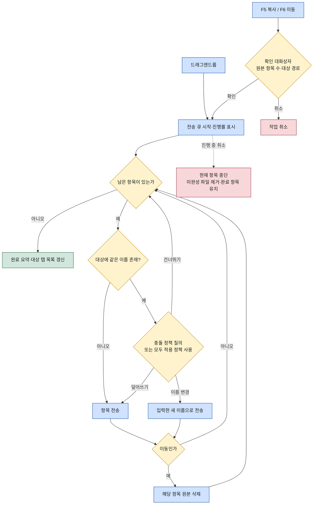

# 파일 관리 (File Manager)

이 문서는 WorkDeck의 파일 관리 기능을 명세한다. 파일 목록 탭의 탐색·정렬·다중 선택·숨김 파일 토글·기본 파일 조작, 워크스페이스 분할 위에서 파일 목록 탭 두 개를 나란히 놓고 수행하는 듀얼 파일 작업(F5 복사 / F6 이동 / 드래그앤드롭, 진행률·취소·이름 충돌 처리), 그리고 로컬↔원격 전 조합의 동작과 제약을 다룬다. 화면 구조·탭 오픈 규칙·분할 동작은 [02-ui-layout.md](../02-ui-layout.md)를 전제로 하고, 원격 접속의 프로필·인증은 [features/connections.md](connections.md)를 따른다.

## 1. 파일 목록 탭

파일 목록 탭은 하나의 폴더 내용을 표시하는 콘텐츠 탭이다. 로컬 파일 목록 탭은 로컬 폴더 경로를, 원격 파일 목록 탭은 연결 프로필과 원격 경로를 대상으로 한다. 여는 경로는 세 가지다 — 사이드바 파일 뷰에서 폴더 활성화, 연결 뷰의 "파일로 열기", 북마크 뷰에서 항목 활성화([02-ui-layout.md](../02-ui-layout.md) 3장). **로컬과 원격 파일 목록 탭은 데이터 출처만 다르고 이 장의 UX는 전부 동일하다.** 조합별 제약 차이는 3장에서 다룬다.

### 1.1 탐색

파일 목록 탭 안에서의 폴더 이동은 새 탭을 만들지 않는다. 폴더 항목을 활성화(더블클릭 또는 `Enter`)하면 같은 탭이 그 폴더로 이동하며, 탭의 정체성은 "현재 표시 중인 경로"를 따른다 — [02-ui-layout.md](../02-ui-layout.md) 3장의 같은 대상 판정 기준과 일치한다.

- **디렉터리 이동**: 폴더 항목 활성화 → 같은 탭에서 해당 폴더로 이동.
- **상위 이동**: 목록 맨 위에 고정된 `..` 항목 활성화 또는 `Backspace`. 루트(원격은 접속 루트)에서는 `..`이 표시되지 않는다.
- **경로 표시**: 탭 상단의 경로 표시줄이 현재 경로를 세그먼트로 표시하고, 세그먼트 클릭으로 해당 상위 경로로 이동한다. 원격 파일 목록 탭은 경로 앞에 연결 프로필 이름을 함께 표시한다.
- **파일 활성화**: 파일 항목을 활성화하면 미리보기 탭이 열린다. 오픈·중복 검사 규칙은 [02-ui-layout.md](../02-ui-layout.md) 3장, 표시 동작은 [features/preview.md](preview.md)를 따른다.

```
폴더 항목 활성화 → 같은 탭에서 폴더 내용 로드 → 경로 표시줄 갱신 → 첫 항목에 선택 커서
```

### 1.2 정렬

목록은 이름·크기·수정일 세 컬럼을 표시한다. 컬럼 헤더 클릭으로 그 컬럼 기준 정렬, 같은 헤더 재클릭으로 오름/내림차순 토글. 폴더는 항상 파일보다 먼저 그룹으로 묶이고, 그룹 안에서 정렬 기준이 적용된다. 기본값은 이름 오름차순이며, 정렬 상태는 파일 목록 탭별로 유지된다.

### 1.3 다중 선택

| 조작 | 동작 |
|------|------|
| 클릭 / 방향키 | 단일 선택 (기존 선택 해제) |
| `Cmd`(`Ctrl`)+클릭 | 항목 선택 토글 (기존 선택 유지) |
| `Shift`+클릭 / `Shift`+방향키 | 범위 선택 |
| `Space` | 커서 항목 선택 토글 후 커서 아래로 (듀얼 패널 파일 관리자 관습) |
| `Cmd`(`Ctrl`)+`A` | 전체 선택 |

선택된 항목 수와 크기 합계는 탭 하단 상태줄에 표시한다. 파일 조작(1.5장)과 듀얼 파일 작업(2장)은 모두 현재 선택 항목 전체를 대상으로 한다.

### 1.4 숨김 파일 토글

숨김 파일은 기본적으로 표시하지 않으며, 토글로 표시할 수 있다. 토글 상태는 파일 목록 탭별로 적용된다.

- 판정 기준: macOS/Linux와 원격(SFTP/FTP)은 이름이 `.`으로 시작하는 항목, Windows는 숨김 속성.
- 단축키 초안: macOS `Cmd+Shift+.`, Windows/Linux `Ctrl+H` (최종 확정은 [02-ui-layout.md](../02-ui-layout.md) 5장의 키맵 방침에 따라 구현 단계에서).

### 1.5 기본 파일 조작

| 조작 | 키 초안 | 동작 |
|------|---------|------|
| 새 폴더 | `F7` | 현재 경로에 폴더 생성, 이름 인라인 입력 |
| 이름 변경 | `F2` | 커서 항목 이름 인라인 편집 |
| 삭제 | `F8` 또는 `Delete` | 선택 항목 전체 삭제 (확인 대화상자 후) |

모든 조작은 컨텍스트 메뉴에서도 접근할 수 있다. 규칙:

- **삭제**: 로컬은 OS 휴지통으로 이동한다. 원격은 휴지통이 없으므로 즉시 영구 삭제하며, 확인 대화상자에 "영구 삭제" 경고를 명시한다. 폴더 삭제는 하위 항목 포함 재귀 삭제다.
- **이름 충돌**: 새 폴더·이름 변경에서 같은 이름이 이미 존재하면 오류를 표시하고 편집 상태를 유지한다.
- **조작 후**: 목록을 갱신하고, 새로 만든/이름 바꾼 항목에 선택 커서를 둔다.

## 2. 분할 기반 듀얼 파일 작업

워크스페이스를 좌우 분할하고 양쪽 분할 영역의 활성 탭이 모두 파일 목록 탭이면 듀얼 파일 작업이 활성화된다. **원본은 포커스된 분할 영역의 활성 파일 목록 탭에서 선택된 항목들, 대상은 반대 분할 영역의 활성 파일 목록 탭이 표시 중인 경로다.** 이 규칙은 로컬↔로컬·로컬↔원격·원격↔원격 어느 조합이든 동일하다(3장). 조건이 갖춰지지 않으면(분할 상태가 아님, 반대 영역의 활성 탭이 파일 목록 탭이 아님, 선택 항목 없음) F5/F6은 비활성이다.

### 2.1 트리거

- **F5 복사 / F6 이동**: 포커스된 영역 → 반대 영역 방향으로 실행. 시작 전 확인 대화상자(원본 항목 수·대상 경로)를 표시한다.
- **드래그앤드롭**: 원본 파일 목록 탭에서 선택 항목을 끌어 반대 영역의 파일 목록 탭에 놓는다. 폴더 항목 위에 놓으면 그 폴더가 대상 경로, 목록의 빈 부분에 놓으면 그 탭의 현재 경로가 대상이다. 드롭 자체가 의사 표시이므로 확인 대화상자 없이 즉시 시작한다. 기본 동작은 복사이며, 이동으로 전환하는 수식키는 OS 관습에 맞춰 구현 단계에서 확정한다.

### 2.2 복사/이동 절차

작업은 항목 단위 큐로 처리한다. 트리거(및 F5/F6의 확인) 후 진행률 표시와 함께 큐가 시작되고, 항목마다 ① 대상에 같은 이름이 있는지 충돌 검사 → ② 충돌이면 사용자에게 정책 질의(덮어쓰기/건너뛰기/이름 변경, 2.4장) → ③ 전송 → ④ 이동이면 그 항목의 전송이 완전히 성공한 뒤에만 원본 삭제, 순으로 진행한다. 모든 항목 처리 후 완료 요약을 표시하고 대상 탭의 목록을 갱신한다.

**이동 안전 규칙**: 원본 삭제는 항목 단위로, 대상 기록이 완전히 끝난 것을 확인한 뒤에만 수행한다. 따라서 취소·실패가 어느 시점에 일어나도 원본이 유실되는 경우는 없다. 같은 볼륨의 로컬 이동과 같은 연결의 원격 이동은 전송 없이 rename으로 즉시 처리한다(3장 표).



### 2.3 진행률 표시와 취소

- **진행률**: 작업 시작과 함께 진행률 표시가 나타난다 — 전체 진행률(바이트 기준), 처리 항목 수(n/전체), 현재 처리 중인 항목 이름. 작업은 비동기로 수행되어 진행 중에도 워크스페이스의 다른 탭을 조작할 수 있다.
- **취소**: 진행률 표시의 취소 버튼으로 언제든 중단할 수 있다. 취소 시 ① 전송 중이던 미완성 파일을 대상에서 제거하고 ② 남은 항목은 처리하지 않으며 ③ 이미 완료된 항목은 유지한다(롤백 없음). 이동 취소의 경우에도 2.2장의 안전 규칙에 따라 완료된 항목의 원본만 삭제된 상태다.

### 2.4 이름 충돌 처리

대상 경로에 같은 이름의 항목이 이미 있으면 충돌 대화상자를 표시한다. 대화상자는 원본과 대상 항목의 크기·수정일을 나란히 보여주고 세 가지 선택지를 제공한다.

| 선택지 | 동작 |
|--------|------|
| 덮어쓰기 | 대상의 기존 항목을 원본으로 대체 |
| 건너뛰기 | 해당 항목을 처리하지 않고 다음 항목으로 |
| 이름 변경 | 새 이름을 입력받아 그 이름으로 전송 (새 이름도 충돌 검사) |

- **모두 적용**: 대화상자의 "남은 충돌에 모두 적용" 체크박스를 켜면 이후 충돌은 질의 없이 같은 정책으로 처리한다.
- **폴더끼리 충돌**: 덮어쓰기 선택 시 폴더를 통째로 대체하지 않고 병합한다 — 내부 항목 단위로 충돌 검사를 재귀 적용한다.
- **타입이 다른 충돌**(파일↔폴더): 덮어쓰기는 제공하지 않고 건너뛰기/이름 변경만 제공한다.

## 3. 로컬↔원격 전 조합

**원격 파일 목록 탭은 로컬 파일 목록 탭과 동일한 UX를 가진다** — 1장의 탐색·정렬·다중 선택·숨김 파일 토글·기본 파일 조작과 2장의 F5/F6/드래그앤드롭이 전부 같은 방식으로 동작한다. 조합에 따라 달라지는 것은 전송 경로와 제약뿐이다. 원격 프로토콜(SFTP/FTP)은 연결 프로필이 결정한다([features/connections.md](connections.md)).

| 조합 | 복사 | 이동 | 제약·비고 |
|------|------|------|-----------|
| 로컬 → 로컬 | OS 파일시스템 복사 | 같은 볼륨이면 rename으로 즉시, 다른 볼륨이면 복사 후 원본 삭제 | 가장 빠름. 이동·삭제의 원본 정리는 휴지통 경유 |
| 로컬 → 원격 | 업로드 (SFTP/FTP) | 업로드 성공 후 로컬 원본 삭제(휴지통) | 퍼미션 보존은 SFTP만 가능. FTP의 수정일 보존은 서버의 MFMT 지원에 따름 |
| 원격 → 로컬 | 다운로드 (SFTP/FTP) | 다운로드 성공 후 원격 원본 삭제(영구) | 원격 원본 삭제는 휴지통 없이 영구 |
| 원격 → 원격 (같은 연결) | 로컬 중계 (다운로드 후 업로드) | 서버 측 rename으로 즉시 (SFTP rename / FTP RNFR·RNTO) | SFTP/FTP에 표준 서버 측 복사 명령이 없어 복사는 로컬 중계 |
| 원격 → 원격 (다른 연결) | 로컬 중계 (다운로드 후 업로드) | 중계 복사 성공 후 원본 삭제(영구) | 속도는 양쪽 대역폭 중 낮은 쪽에 묶임. 로컬 임시 공간 필요 |

공통 제약:

- 원격에서의 삭제(이동에 따른 원본 삭제 포함)는 모두 영구 삭제다 — 휴지통이 없다.
- 로컬 중계에 사용한 임시 파일은 작업 완료·취소 시 즉시 정리한다.
- 심볼릭 링크의 처리(따라가기/제외)는 구현 단계에서 확정한다.
- 원격 작업 중 연결이 끊기면 해당 항목은 실패로 처리하고(미완성 파일 제거) 완료 항목은 유지한다 — 취소와 같은 정리 규칙. 재연결 정책은 [features/connections.md](connections.md)를 따른다.

## 4. 관련 문서

- [02-ui-layout.md](../02-ui-layout.md) — 탭 오픈·중복 검사 규칙, 워크스페이스 분할, 키맵 방침
- [features/connections.md](connections.md) — 연결 프로필, "파일로 열기" 액션, 인증·재연결
- [features/preview.md](preview.md) — 파일 활성화로 열리는 미리보기 탭
- [features/bookmarks.md](bookmarks.md) — 저장된 경로에서 파일 목록 탭 열기
- [03-architecture.md](../03-architecture.md) — 파일시스템·연결 모듈과 IPC 경계
