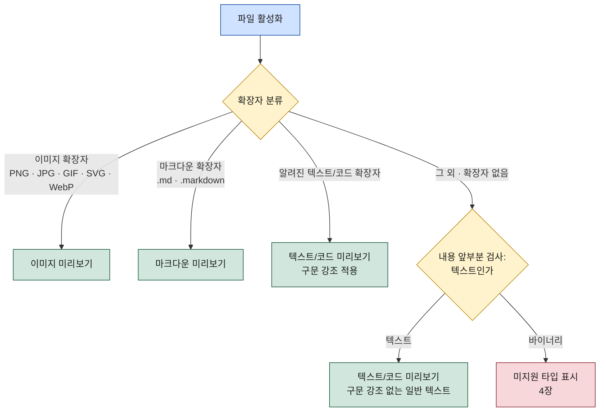

# 미리보기 (Preview)

이 문서는 미리보기 탭의 동작을 명세한다. 미리보기는 파일 내용을 읽기 전용으로 보여주는 콘텐츠 탭이며, 사이드바의 파일 뷰 또는 파일 목록 탭에서 파일을 활성화하면 열린다. MVP 지원 범위는 텍스트/코드(구문 강조), 마크다운(렌더+원본 토글), 이미지(확대/축소) 세 가지이고, 그 외 타입은 파일 정보와 "미리보기 미지원" 안내를 표시한다. 탭 오픈·중복 검사 규칙은 [02-ui-layout.md](../02-ui-layout.md)의 콘텐츠 탭 모델을 따르고, 내용 전달·렌더링의 프로세스 경계는 [03-architecture.md](../03-architecture.md)의 미리보기 모듈 정의를 따른다.

## 1. 미리보기 탭 동작

### 1.1 열림 규칙

미리보기 탭은 파일을 활성화할 때 열린다. 진입 경로는 두 가지다.

| 진입 경로 | 대상 파일 |
|-----------|-----------|
| 사이드바 파일 뷰에서 파일 활성화 | 로컬 파일 |
| 파일 목록 탭에서 파일 활성화 | 로컬 파일 또는 원격 파일 (원격 파일 목록 탭이면 해당 연결의 파일) |

두 경로 모두 결과는 동일하다 — 워크스페이스의 포커스된 분할 영역에 미리보기 탭이 열린다(분할하지 않았다면 단일 영역). 탭을 열기 전 중복 검사를 하며, **같은 파일의 미리보기 탭이 이미 열려 있으면 새 탭을 만들지 않고 기존 탭에 포커스한다.** "같은 파일"의 판정 기준은 [02-ui-layout.md](../02-ui-layout.md) 3장과 동일하다: 파일 경로가 같으면 같은 파일이고, 원격 파일은 연결 프로필까지 같아야 한다. 중복 검사는 분할 여부와 무관하게 워크스페이스 전체를 대상으로 한다.

```
파일 활성화 (사이드바 파일 뷰 또는 파일 목록 탭)
        ↓
같은 파일의 미리보기 탭이 이미 열려 있는가
        ├─ 예   → 기존 미리보기 탭에 포커스 (새 탭 생성 안 함)
        └─ 아니오 → 포커스된 분할 영역에 새 미리보기 탭 오픈
                    → 타입 판별(2장) → 타입별 표시(3장 또는 4장)
```

### 1.2 읽기 전용

미리보기 탭은 읽기 전용이다. 편집·저장 기능이 없고, 미리보기에서 파일 내용이 변경되는 경우는 없다. 내용은 탭을 열 때 읽은 시점 기준으로 표시하며, 이후 파일이 바뀌어도 자동으로 갱신하지 않는다(자동 갱신은 2차 이후 후보 — [04-roadmap.md](../04-roadmap.md) 3장). 대신 탭 안에 **수동 새로고침** 버튼과 마지막으로 읽은 시각을 표시한다 — 중복 검사로 기존 탭에 포커스될 때도 이 시각은 갱신되지 않으므로, 사용자가 오래된 내용을 보고 있다는 사실을 인지할 수 있다.

### 1.3 내용 전달과 오류

파일 내용은 로컬 파일이면 main의 파일시스템 모듈, 원격 파일이면 연결 모듈이 전달하고, 타입 판별과 렌더링은 renderer의 미리보기 모듈이 수행한다([03-architecture.md](../03-architecture.md) 2.4절). 내용을 읽지 못한 경우(권한 없음, 파일 삭제됨, 원격 연결 끊김 등)에는 탭을 닫지 않고 탭 안에 실패 원인 안내를 표시한다.

## 2. 타입 판별

미리보기 타입은 파일을 열 때 한 번 판별한다. 1차 기준은 확장자다 — 이미지 확장자(PNG/JPG/GIF/SVG/WebP)면 이미지 미리보기, 마크다운 확장자(`.md`, `.markdown`)면 마크다운 미리보기, 알려진 텍스트/코드 확장자면 텍스트/코드 미리보기로 직행한다. 어느 목록에도 없는 확장자(또는 확장자 없음)는 내용 앞부분을 검사해 텍스트인지 바이너리인지 판별한다. 텍스트로 판별되면 구문 강조 없는 일반 텍스트로 표시하고, 바이너리면 미지원 타입 동작(4장)으로 처리한다.



## 3. MVP 지원 타입별 동작

MVP에서 지원하는 미리보기 타입과 동작 요약은 아래 표와 같다. 상세 규칙은 각 하위 절에서 정의한다.

| 타입 | 대상 | 표시 방식 | 조작 |
|------|------|-----------|------|
| 텍스트/코드 | 알려진 텍스트/코드 확장자, 내용 검사로 텍스트 판별된 파일 | 구문 강조된 읽기 전용 텍스트 (인코딩 자동 처리) | 스크롤. 대용량 파일은 앞부분만 표시 + 안내 |
| 마크다운 | `.md`, `.markdown` | 렌더 표시 (기본) | 렌더 ↔ 원본 토글 |
| 이미지 | PNG / JPG / GIF / SVG / WebP | 이미지 표시 | 확대/축소, 창 맞춤, 실제 크기 |

### 3.1 텍스트/코드

- **구문 강조** — 확장자로 언어를 판별해 구문 강조를 적용한다. 언어를 판별할 수 없는 텍스트는 강조 없는 일반 텍스트로 표시한다. 줄 번호를 함께 표시한다.
- **인코딩 처리** — 기본 인코딩은 UTF-8이다. BOM이 있으면 BOM을 우선한다(UTF-8/UTF-16). UTF-8 디코딩에 실패하면 휴리스틱으로 인코딩을 추정해(EUC-KR 등) 재시도하고, 추정에 성공하면 감지된 인코딩 이름을 탭 안에 표시한다. 끝내 판별하지 못한 문자는 대체 문자(�)로 표시하고 "인코딩을 판별하지 못했습니다" 안내를 함께 띄운다.
- **대용량 파일 처리** — 파일 크기가 임계값을 넘으면 전체를 읽지 않고 앞부분 일정량만 읽어 표시하며, 내용 상단에 "파일이 커서 앞부분만 표시합니다 (전체 N MB 중 M MB)" 안내 배너를 띄운다. 구문 강조는 표시된 앞부분에만 적용한다. 원격 파일도 동일하다 — 앞부분만 전송받는다. 임계값과 표시량의 초안 값은 임계값 10MB, 표시량 첫 1MB이며, 최종 확정은 구현 단계에서 한다.

### 3.2 마크다운

마크다운 렌더링의 원본은 **신뢰할 수 없는 입력**으로 취급한다 — 로컬 파일이든 원격 파일이든, 그 내용을 renderer가 그대로 실행 가능한 형태로 표시하면 안 된다.

- **렌더 표시 (기본)** — 마크다운 파일은 렌더된 결과를 기본으로 표시한다. 렌더링 전 원문에 포함된 raw HTML은 제거하거나 화이트리스트 기반으로 새니타이즈한다(스크립트·이벤트 핸들러·`javascript:`/`data:` URI·`<iframe>`·`<object>` 등은 전부 제거). 렌더 결과 안에서는 외부 리소스(이미지 등)의 자동 로드도 로컬 파일·같은 연결의 원격 파일 기준으로 제한하고, 임의 원격 URL 로드는 차단한다 — 렌더링 영역 자체의 프로세스 격리·CSP 방침은 [03-architecture.md](../03-architecture.md) 1.1절을 따른다.
- **원본 토글** — 탭 안의 토글로 렌더 표시와 원본(마크다운 소스) 표시를 전환한다. 원본 표시는 3.1절의 텍스트/코드 동작(마크다운 구문 강조, 인코딩 처리, 대용량 처리)을 그대로 따른다 — 원본은 텍스트로만 표시되므로 새니타이즈 대상이 아니다. 토글 상태는 탭 단위이며, 새로 여는 마크다운 미리보기 탭은 항상 렌더 표시로 시작한다.
- **대용량 파일** — 3.1절의 임계값을 넘는 마크다운 파일은 렌더하지 않고 원본 표시(앞부분만 + 안내)로 연다.

### 3.3 이미지

- **지원 포맷** — PNG, JPG, GIF, SVG, WebP. GIF는 애니메이션을 재생한다. SVG는 스크립트를 실행하지 않고 정적 이미지로만 렌더링한다.
- **확대/축소** — 확대/축소(줌 인/아웃), 창 맞춤(미리보기 영역 크기에 맞춤), 실제 크기(100%) 세 가지 배율 조작을 제공한다. 기본 표시는 이미지가 미리보기 영역보다 크면 창 맞춤, 작으면 실제 크기다.
- **정보 표시** — 이미지 해상도(가로×세로 픽셀)와 파일 크기를 탭 안에 함께 표시한다.

## 4. 미지원 타입 동작

바이너리로 판별된 파일 등 지원하지 않는 타입도 미리보기 탭은 열린다. 탭을 열지 않거나 오류를 띄우는 대신, 파일 정보와 함께 "미리보기 미지원" 안내를 표시한다.

표시 내용:

| 항목 | 내용 |
|------|------|
| 파일 이름 | 파일명 (확장자 포함) |
| 크기 | 파일 크기 |
| 수정일 | 마지막 수정 일시 |
| 안내 | "이 파일 형식은 미리보기를 지원하지 않습니다" |

원격 파일도 동일하게 처리한다(파일 정보는 연결 모듈이 전달한 원격 메타데이터 기준). 미지원 타입 탭도 1.1절의 중복 검사 대상이다 — 같은 파일을 다시 활성화하면 기존 탭에 포커스한다.

## 5. 향후 과제

아래 타입은 MVP 범위 밖이며 이 문서에서 명세하지 않는다. 배치와 우선순위는 [04-roadmap.md](../04-roadmap.md)를 따른다. MVP에서는 모두 4장의 미지원 타입 동작으로 처리한다.

- PDF 미리보기
- 영상/오디오 미리보기
- 압축파일 내용 목록 (ZIP 등 아카이브 내부 항목 표시)

이 타입들은 미리보기 렌더러 확장 포인트를 통해 플러그인으로 추가될 수 있다 — [05-plugin-system.md](../05-plugin-system.md) 참조.

## 6. 관련 문서

- [02-ui-layout.md](../02-ui-layout.md) — 콘텐츠 탭 오픈 규칙, 같은 대상 판정 기준, 분할
- [file-manager.md](file-manager.md) — 파일 목록 탭 (미리보기 탭의 진입 경로)
- [connections.md](connections.md) — 원격 파일 접근의 기반이 되는 연결 프로필
- [03-architecture.md](../03-architecture.md) — 미리보기 모듈의 프로세스 경계 (renderer 렌더링, main 내용 전달)
- [04-roadmap.md](../04-roadmap.md) — PDF/영상/오디오/압축파일 미리보기의 로드맵 배치
