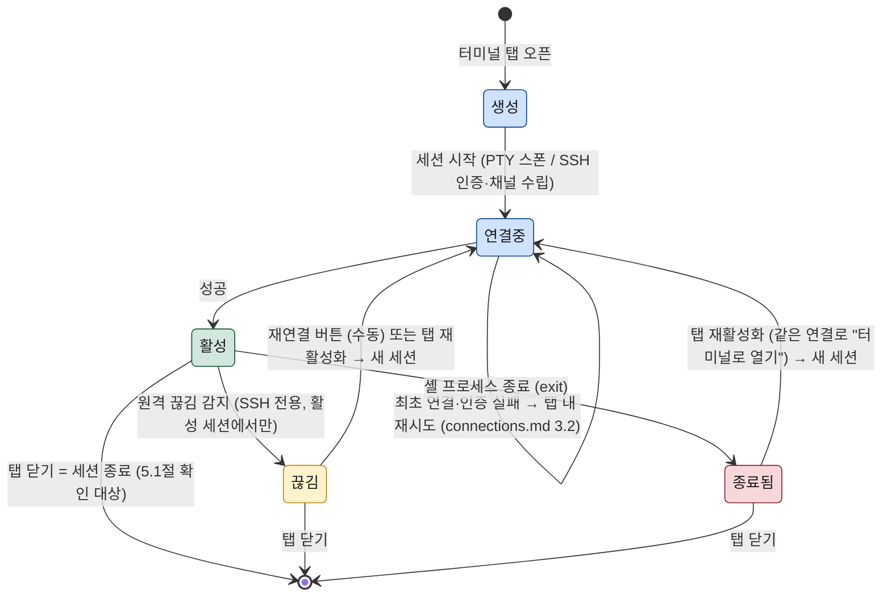

# 터미널

이 문서는 WorkDeck의 터미널 기능을 명세한다. 터미널은 로컬 터미널 탭과 SSH 터미널 탭 두 종류의 콘텐츠 탭으로 제공되며, 두 탭의 생성 조건, 시작 작업 디렉터리와 사용 셸, 세션 수명(탭 닫기·프로세스 종료·원격 끊김과 수동 재연결)을 정의한다. 화면 구조와 탭 오픈·중복 규칙은 [02-ui-layout.md](../02-ui-layout.md)를, 프로세스·모듈 구조(node-pty, xterm.js, ssh2)는 [03-architecture.md](../03-architecture.md)를 전제로 한다.

## 1. 터미널 탭의 종류와 공통 사항

터미널 탭은 두 종류다. **로컬 터미널 탭**은 이 컴퓨터의 셸을 실행하고, **SSH 터미널 탭**은 연결의 "터미널로 열기" 액션으로 원격 셸에 접속한다. 종류와 무관하게 공통 규칙은 다음과 같다.

- 두 탭 모두 워크스페이스의 콘텐츠 탭이다. 탭 전환·닫기·분할 영역 간 이동 규칙은 [02-ui-layout.md](../02-ui-layout.md)를 그대로 따른다.
- 화면 렌더링은 renderer의 xterm.js가 담당하고, 실제 세션(PTY / SSH 셸 채널)은 main의 터미널 모듈이 소유한다. renderer는 로컬/SSH를 구분하지 않는다([03-architecture.md](../03-architecture.md) 2.3절).
- 터미널 탭이 포커스일 때 일반 키 입력은 모두 터미널로 전달된다. 앱 전역 단축키는 `Cmd`(`Ctrl`) 조합으로만 구성한다([02-ui-layout.md](../02-ui-layout.md) 5장).
- 하나의 터미널 탭은 하나의 세션과 1:1로 대응한다. 탭이 곧 세션의 수명 단위다(5장).

## 2. 로컬 터미널 탭

### 2.1 생성 방법

로컬 터미널 탭은 사이드바 항목 활성화가 아니라 **명령으로 생성한다** — 앱 메뉴의 "새 로컬 터미널"과 그에 대응하는 단축키(키 조합은 02-ui-layout.md 5장의 방침에 따라 구현 단계에서 확정). 실행할 때마다 새 탭과 새 세션이 생성되며, 개수 제한은 없다. 사이드바에서 여는 탭이 아니므로 [02-ui-layout.md](../02-ui-layout.md) 3장의 "같은 대상" 중복 검사 대상이 아니다.

새 탭은 다른 콘텐츠 탭과 동일하게 현재 포커스된 분할 영역에 열린다.

### 2.2 시작 작업 디렉터리 규칙

로컬 터미널은 사용자가 지금 보고 있는 위치에서 열리는 것을 기본으로 한다. 생성 시점에 포커스된 분할 영역의 활성 콘텐츠 탭이 **로컬 파일 목록 탭이면 그 탭이 표시 중인 디렉터리**에서 시작하고, 그 외의 모든 경우(활성 탭이 미리보기·터미널·원격 파일 목록 탭이거나, 열린 탭이 없는 경우)에는 **사용자 홈 디렉터리**에서 시작한다. 원격 파일 목록 탭의 경로는 로컬 파일시스템에 존재하지 않으므로 홈으로 처리한다.

```
"새 로컬 터미널" 실행
        ↓
포커스된 영역의 활성 탭이 로컬 파일 목록 탭인가?
        ├─ 예  → 그 탭의 현재 디렉터리에서 셸 시작
        └─ 아니오 → 홈 디렉터리에서 셸 시작
```

### 2.3 사용 셸

사용자의 기본 셸을 실행한다.

| 플랫폼 | 셸 |
|--------|-----|
| macOS / Linux | 사용자의 로그인 셸 (`$SHELL`, macOS 기본 zsh) |
| Windows | PowerShell |

셸은 node-pty의 PTY로 스폰되며 로그인 셸 초기화 파일(예: `.zshrc`)이 정상 적용된다. 셸 선택 설정은 MVP에서 제공하지 않는다.

## 3. SSH 터미널 탭

### 3.1 생성 방법

SSH 터미널 탭은 **연결 뷰에서 연결의 "터미널로 열기" 액션으로만 생성된다.** 액션 선택 UI(더블클릭 기본 동작·컨텍스트 메뉴)와 연결 프로필의 필드·인증은 [features/connections.md](connections.md)가 소관이다. 이 문서는 액션 실행 이후 — 탭 생성부터 세션 종료까지 — 를 다룬다.

액션이 실행되면 새 SSH 터미널 탭이 열리고, main의 터미널 모듈이 연결 모듈에서 해당 연결의 SSH 셸 채널을 받아 세션을 시작한다. 셸은 원격 계정의 로그인 셸이고, 시작 디렉터리는 원격 로그인 기본 디렉터리(통상 원격 홈)다 — 로컬 터미널의 시작 디렉터리 규칙(2.2절)은 적용되지 않는다.

### 3.2 같은 연결의 복수 세션

**MVP에서는 연결당 SSH 터미널 탭(세션)을 1개만 허용한다.** 이는 [02-ui-layout.md](../02-ui-layout.md) 3장의 중복 검사 규칙("SSH 터미널 탭의 같은 대상 판정 기준 = 연결 프로필이 같음")의 직접 귀결이며, 세션 목록·전환 UI 없이 "연결 하나 = 터미널 하나"로 MVP를 단순하게 유지하기 위한 의도적 제약이다. 같은 연결에서 "터미널로 열기"를 다시 실행하면 새 탭을 만들지 않고 기존 SSH 터미널 탭에 포커스한다 — **단, 그 탭이 "종료됨" 또는 "끊김" 상태(5.4절)라면 포커스와 동시에 그 탭에서 새 세션을 시작한다.** 이 규칙이 없으면 `exit`으로 나가거나 끊긴 탭이 막다른 상태가 되어 같은 연결로 다시 들어갈 방법이 없어진다. 연결당 복수 세션은 2차 이후 후보다([04-roadmap.md](../04-roadmap.md) 3장) — 필요해지면 이 중복 판정 기준 자체를 바꿔야 한다.

같은 연결이라도 SSH 터미널 탭과 원격 파일 목록 탭은 서로 다른 대상이므로 하나의 연결에서 두 탭이 공존할 수 있다(02-ui-layout.md 3장).

SSH 터미널 탭을 닫으면 그 셸 채널의 세션이 종료된다. 연결 자체(하부 접속)의 수명 관리는 연결 모듈 소관이며 [features/connections.md](connections.md)를 따른다.

## 4. 생성 조건 요약

| 항목 | 로컬 터미널 탭 | SSH 터미널 탭 |
|------|----------------|----------------|
| 생성 방법 | "새 로컬 터미널" 명령 (메뉴·단축키) | 연결 뷰 → 연결의 "터미널로 열기" 액션 |
| 시작 디렉터리 | 활성 로컬 파일 목록 탭의 현재 디렉터리, 없으면 홈 (2.2절) | 원격 로그인 기본 디렉터리 |
| 사용 셸 | 사용자 기본 셸 (macOS/Linux: 로그인 셸, Windows: PowerShell) | 원격 계정의 로그인 셸 |
| 복수 세션 | 제한 없음 — 실행마다 새 탭 | 연결당 1개 — 재실행 시 기존 탭 포커스 |
| 탭 제목 | 시작 디렉터리 이름 | 연결 프로필 이름 |
| 세션 구현 | node-pty PTY (터미널 모듈) | ssh2 셸 채널 (터미널 모듈 ← 연결 모듈) |

## 5. 세션 수명

### 5.1 탭 닫기 = 세션 종료

터미널 탭을 닫으면 세션이 즉시 종료된다 — 로컬은 PTY와 셸 프로세스(실행 중인 자식 프로세스 포함)를 종료하고, SSH는 셸 채널을 닫는다. 탭을 닫아 두고 세션만 백그라운드로 유지하는 개념은 없다. 앱 종료는 모든 터미널 탭을 닫는 것과 동일하게 모든 세션을 종료한다.

**닫기 확인**: 세션이 "활성" 상태이고 로컬 터미널에 실행 중인 자식 프로세스가 있거나 SSH 세션인 경우, 탭 닫기(마우스·컨텍스트 메뉴·단축키 모두 포함)는 확인 대화상자를 거친다([02-ui-layout.md](../02-ui-layout.md) 5장 방침 4) — 셸이 유휴 상태이거나 탭이 이미 "종료됨"·"끊김" 상태이면 확인 없이 바로 닫는다.

### 5.2 프로세스 종료 시 탭 상태

셸 프로세스가 스스로 종료되면(`exit`, 원격 셸의 `logout`, 프로세스 비정상 종료) 탭은 **자동으로 닫히지 않는다.** 세션은 "종료됨" 상태가 되고, 탭에는 지금까지의 출력이 그대로 남은 채 종료 안내(종료 코드 포함)가 표시된다. 마지막 출력을 확인할 기회를 보존하기 위한 규칙이며, 탭은 사용자가 직접 닫는다. 종료됨 상태의 탭은 입력을 받지 않는다.

### 5.3 원격 끊김 감지와 수동 재연결

SSH 터미널 세션은 원격 연결이 유지되어야 살아 있다. 연결 모듈이 끊김(소켓 종료, 네트워크 오류, keepalive 무응답)을 감지하면 터미널 모듈이 세션을 "끊김" 상태로 전환한다. 로컬 터미널에는 원격 연결이 없으므로 끊김 상태가 존재하지 않는다.

끊김 상태의 동작:

- 탭은 닫히지 않고 유지되며, 스크롤백(지금까지의 출력)이 보존된다.
- 입력은 비활성화되고, 탭 내에 끊김 알림과 **"재연결" 버튼**이 표시된다.
- 재연결은 **수동이 기본이다** — 재연결 버튼을 눌러야 시도한다. 자동 재연결은 MVP에서 제공하지 않는다.

재연결 버튼을 누르면 연결을 다시 수립하고 새 셸 세션을 시작한다. 성공하면 기존 스크롤백 아래에서 새 세션의 출력이 이어진다 — 단, **이전 셸의 상태(작업 디렉터리, 환경 변수, 실행 중이던 프로세스)는 복원되지 않는다.** 원격에서 세션을 보존하려면 사용자가 tmux/screen 등을 쓰는 것이 전제이며, WorkDeck이 이를 대신하지 않는다. 재연결이 실패하면 오류를 표시하고 끊김 상태를 유지하며, 재시도할 수 있다.

### 5.4 세션 상태 전이

세션의 전체 수명은 다섯 상태로 정리된다. 탭이 열리면 세션이 **생성**되고, PTY 스폰 또는 SSH 인증·셸 채널 수립이 진행되는 동안 **연결중**이다. 성공하면 **활성** — 입출력이 흐르는 정상 상태다. **최초 연결·인증의 실패는 끊김 상태로 넘어가지 않는다** — [features/connections.md](connections.md) 3.2절이 소관하는 대로 탭은 연결중 상태에 머무르며 탭 안에 원인을 표시하고 그 자리에서 재시도한다. 활성에서 벗어나는 길은 두 가지다: 셸 프로세스가 스스로 끝나면 **종료됨**(탭 잔존, 5.2절), SSH에서 이미 수립된 세션의 원격 끊김이 감지되면 **끊김**(재연결 버튼으로 다시 연결중으로 진입, 5.3절). 사용자가 탭을 닫으면 어느 상태에서든 세션이 소멸한다(5.1절). **종료됨·끊김 상태의 탭은 막다른 상태가 아니다** — 같은 연결로 "터미널로 열기"를 다시 실행하면([features/connections.md](connections.md) 3.2절) 그 탭에서 새 세션을 시작해 연결중으로 되돌아간다(3.2절). 끊김 상태와 그 재연결 루프는 SSH 터미널 전용이며, 로컬 터미널은 생성 → 연결중 → 활성 → 종료됨의 경로만 가진다.



## 6. 관련 문서

- [02-ui-layout.md](../02-ui-layout.md) — 콘텐츠 탭 오픈·중복 규칙, 분할, 키보드 조작 원칙
- [features/connections.md](connections.md) — 연결 프로필, "터미널로 열기" 액션, 인증과 연결 수명
- [03-architecture.md](../03-architecture.md) — 터미널 모듈·연결 모듈 구조와 node-pty / xterm.js / ssh2
- [01-overview.md](../01-overview.md) — 핵심 개념 정의와 문서 세트 목차
